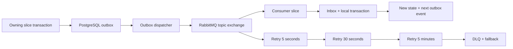

# Technical Specification: Autonomous Inspection Platform

## Executive Summary

The Autonomous Inspection Platform will replace the current Contract Service POC with a new `services/inspection` modular monolith organized by vertical slice. Four Go composition roots—API, worker, scheduler, and migrator—share feature code without becoming separately owned services. A single TypeScript Next.js application provides the internal dashboard and the external capture PWA. Domain APIs are GraphQL with gqlgen; REST is limited to operational endpoints and provider webhooks.

PostgreSQL is the source of truth and uses capability schemas, mandatory `tenant_id`, application checks, and forced Row-Level Security. GORM remains the persistence library by user decision. A dedicated migrator runs additive `AutoMigrate` plus versioned Go migrations for destructive changes, backfills, RLS, and advanced constraints. Cross-capability synchronous collaboration uses a typed in-process command/query bus; durable effects use PostgreSQL outbox, RabbitMQ, and consumer inboxes. MinIO-compatible storage remains private, direct multipart uploads are resumable, and media is verified and screened by a pure-Go sensitive-content detector before LiteLLM analysis. Reports render through private Gotenberg Chromium.

The primary trade-offs are explicit. GORM reduces handwritten persistence code but requires stronger schema-contract tests and explicit migrations for database features. A pure-Go sensitive-content detector simplifies packaging but accepts lower initial accuracy. SPA PKCE avoids a Next.js BFF but requires strict CORS, in-memory internal tokens, and OIDC reauthentication after reload. External sessions use a separate two-hour server-side cookie so capture and uploads survive refresh.

## System Architecture

### Repository Topology

```text
.
├── apps/
│   └── web/                         # Next.js dashboard + capture PWA
├── libs/
│   └── identity/                    # Existing shared UUID type
├── services/
│   └── inspection/
│       ├── cmd/
│       │   ├── inspection-api/
│       │   ├── inspection-worker/
│       │   ├── inspection-scheduler/
│       │   └── inspection-migrate/
│       └── internal/
│           ├── features/<capability>/<operation>/
│           ├── platform/
│           └── contracts/events/
└── deploy/
    └── docker-compose.yml
```

`services/contract`, its checked-in executable, and its manual Swagger artifacts are removed only after the new API, migrator, and smoke tests pass. No package imports `services/contract/internal` during transition.

### Component Overview

| Component | Responsibility | Boundary |
|---|---|---|
| `inspection-api` | GraphQL, limited REST, authentication, authorization, request-scoped tenant context | No background loops or schema migration |
| `inspection-worker` | Outbox dispatch, event consumers, media verification, sensitive-content detection, AI analysis, reports, notifications, retention | No public user API |
| `inspection-scheduler` | Due RRULE occurrences, milestones, reminders, deadlines, abandoned uploads, retention scheduling | Creates work through commands and outbox only |
| `inspection-migrate` | Capability schemas, GORM AutoMigrate, versioned Go migrations, RLS policies, schema version | Only process allowed to change schema |
| Next.js web | Dashboard SPA, external capture PWA, GraphQL client, IndexedDB resumability | No authoritative business decisions |
| PostgreSQL | Transactional source of truth, RLS, outbox/inbox, immutable version metadata, read models | No public network exposure |
| RabbitMQ | Durable at-least-once integration events and job delivery | Never source of truth |
| Dragonfly | OTP and request rate limits, short ephemeral coordination | Never authoritative session or business storage |
| MinIO | Private immutable originals, parts, derivatives, and report artifacts | Access only through scoped presigned operations |
| LiteLLM | Provider-neutral vision and summary completion gateway | Receives only authorized normalized media after screening |
| Gotenberg | Private Chromium HTML-to-PDF rendering | Receives immutable report snapshot only |
| Keycloak | Local OIDC provider for internal users | Authentication only; authorization remains in PostgreSQL |
| SMTP/Twilio adapters | Email, WhatsApp, SMS, and delivery callbacks | Per-channel status and bounded retry |
| Mailpit/fake Twilio | Safe local notification sinks | Development and automated tests only |
| OpenTelemetry/metrics | Traces, structured logs, metrics, correlation | No business state |

### Vertical Slice Boundaries

Every slice owns its boundary DTO, validation, use-case orchestration, local transaction, minimal dependency interfaces, and black-box Setup test. `Setup` registers exactly one primary entry point: GraphQL resolver, REST route, mediator handler, RabbitMQ consumer, or scheduler job. A capability directory groups related operations but is not a global controller/service/repository layer.

Initial slices:

| Capability | Operations |
|---|---|
| `tenancy` | `create_tenant`, `update_tenant`, `create_business_unit`, `archive_business_unit`, `list_business_units` |
| `access` | `resolve_me`, `invite_internal_user`, `assign_role_scope`, `disable_user`, `authorize_resource` |
| `participants` | `upsert_participant`, `verify_channel`, `set_delivery_channels`, `deactivate_participant` |
| `segments` | `publish_definition`, `activate_definition`, `list_definitions` |
| `templates` | `publish_template`, `activate_template`, `list_templates`, `publish_analysis_profile` |
| `assets` | `register_asset`, `update_asset`, `archive_asset`, `get_asset`, `list_assets` |
| `origins` | `invite_capture`, `start_capture`, `complete_capture`, `activate_version`, `list_versions` |
| `schedules` | `create_schedule`, `update_schedule`, `cancel_schedule`, `materialize_due`, `schedule_reminders` |
| `projects` | `create_project`, `add_exceptional_stage`, `start_stage`, `skip_stage`, `close_project`, `reopen_project` |
| `inspections` | `create_manual`, `create_occurrence`, `cancel`, `invalidate`, `get`, `list` |
| `invitations` | `send`, `resend`, `request_otp`, `verify_otp`, `revoke_session`, `expire` |
| `capture` | `bootstrap`, `save_metadata`, `declare_impossibility`, `submit`, `submit_recapture` |
| `media` | `create_upload`, `complete_upload`, `verify_uploaded`, `generate_derivatives`, `screen_sensitive`, `abort_expired` |
| `recapture` | `request`, `request_automatically`, `expire_request` |
| `analysis` | `request_comparisons`, `process_comparison`, `classify_inspection` |
| `reports` | `generate_snapshot`, `render_pdf`, `get_report`, `download_pdf` |
| `notifications` | `request_delivery`, `deliver_channel`, `receive_twilio_status`, `list_delivery_status` |
| `dashboard` | `summary`, `list_triage`, `project_timeline` |
| `audit` | `record_event`, `list_events` |
| `usage` | `record_usage`, `summarize_usage` |
| `retention` | `configure_policy`, `record_deletion_request`, `schedule_expiry`, `purge_data` |

### Synchronous Flow

1. The API authenticates the caller and resolves tenant membership and scope.
2. A resolver validates transport shape and sends one typed command or query through the mediator.
3. The owning slice uses mediator queries to validate foreign capability prerequisites without reading their tables.
4. The command opens a tenant-scoped local transaction, revalidates local invariants, writes only its capability schema, writes audit intent and outbox events, and commits.
5. The resolver maps typed results and errors to the GraphQL payload without business logic.

No transaction spans two command handlers. Database constraints protect local time-of-check/time-of-use races. Event consumers perform durable downstream work.

### Asynchronous Flow



The dispatcher claims committed rows with `FOR UPDATE SKIP LOCKED` and uses publisher confirms. A consumer acknowledges only after its inbox and local state commit. Duplicate publication and delivery are normal and must not duplicate business outcomes.

### Primary Data Flows

#### Origin

`inviteOriginCapture` creates an invitation and notification event. OTP verification creates a two-hour external session. The PWA requests multipart upload sessions, uploads directly to MinIO, and completes metadata. Media verification, normalization, and sensitive screening finish before origin submission. Submission writes an immutable origin version; activation selects it for future occurrences.

#### Occurrence and Capture

The scheduler or a user creates an occurrence with immutable snapshots of template, reference, policies, participant, deadline, and reminders. Capture bootstrap returns only the external responsibility. Submission freezes evidence and emits `capture.submitted`. A directed recapture adds a new responsibility for selected requirements and delays terminal analysis until corrected or expired.

#### Analysis and Report

Verified evidence produces one comparison job per requirement. Workers load normalized reference/current media, send base64/data URLs to LiteLLM, validate strict structured output, and persist immutable analysis runs and findings. Terminal comparisons trigger deterministic classification, report snapshot generation, Gotenberg rendering, dashboard projection, and internal critical alert when applicable.

#### Retention

Closure of occupancy, service relationship, or project establishes retention start. The scheduler creates purge work when each class expires. Workers delete database associations in an explicit order, remove MinIO originals/parts/derivatives/PDFs, and retain only a deidentified deletion audit event.

Without a tenant override inside allowed bounds, originals/derivatives, inspections, analysis, and reports expire five years after the associated relationship/project closes; operational records and separately usable location expire after one year; invitation, OTP, and session secrets expire at their security deadline. A deletion request before the effective deadline is recorded but denied with the active retention restriction. A legal hold may extend, never shorten, these periods.

### PRD Goal Mapping

| PRD Goal | Technical Components |
|---|---|
| Tenant structure and isolation | Tenancy/access slices, tenant transaction wrapper, RLS, scoped GraphQL connections |
| Recurring, milestone, and manual initiation | Schedules/projects/inspections slices, scheduler, outbox |
| Accountless external capture | Invitations slices, OTP rate limiter, external session store, capture PWA |
| Guided and resumable evidence | Capture/media slices, MinIO multipart, IndexedDB, GraphQL upload control |
| Immutable reproducibility | Version models, append-only evidence/analysis/report tables, object immutability |
| Declarative comparison modes | Segment/template schemas, template compiler, capture renderer |
| Configurable multi-stage behavior | Project/stage state machine, report-mode snapshot |
| Transparent provenance flags | Media metadata, policy evaluator, sensitive detector, report projection |
| Directed recapture | Recapture slices, notification flow, replacement lineage |
| Always produce a terminal report | Analysis terminality coordinator, deterministic classifier, HTML fallback |
| Deterministic priority and critical alerts | Classification domain function, dashboard projection, notification consumer |
| Internal advisory visibility | Access authorization, GraphQL field policy, external-session schema separation |
| Privacy and retention | Consent records, content screening, retention scheduler/purger, audit |
| Three segments without separate apps | Versioned JSON schemas/templates, generic GraphQL JSON scalars, shared renderer |

### User Story Mapping

| Story | Owning Slice or Component | Supporting Components |
|---|---|---|
| US-001 | `tenancy/create_tenant`, `tenancy/create_business_unit` | migrator, web onboarding |
| US-002 | `access/assign_role_scope` | OIDC verifier, RLS, authorization query |
| US-003 | `participants/upsert_participant`, `participants/set_delivery_channels` | channel verification, notification adapters |
| US-004 | `audit/list_events` | audit recorder, correlation context |
| US-005 | `templates/publish_template`, `templates/activate_template` | JSON Schema validator, migrator seeds |
| US-006 | `assets/register_asset`, `assets/update_asset` | segment-definition query, geospatial value objects |
| US-007 | `templates/publish_template`, `assets/update_asset` | policy compiler, occurrence snapshots |
| US-008 | `origins/invite_capture` | invitations/send, notifications |
| US-009 | `origins/start_capture`, `origins/complete_capture` | capture/media pipeline, PWA |
| US-010 | `origins/activate_version` | immutable origin model, occurrence reference query |
| US-011 | `schedules/create_schedule`, `schedules/materialize_due` | RRULE evaluator, scheduler, outbox |
| US-012 | `projects/start_stage`, `inspections/create_manual` | mediator prerequisite queries, outbox |
| US-013 | `schedules/schedule_reminders` | tenant defaults, notification delivery |
| US-014 | `inspections/cancel`, `inspections/invalidate` | session revocation, audit, dashboard projection |
| US-015 | `invitations/request_otp`, `invitations/verify_otp` | Dragonfly limiter, external cookie, consent record |
| US-016 | `capture/bootstrap`, `capture/save_metadata` | template compiler, PWA renderer |
| US-017 | `capture/save_metadata` | GPS/geofence policy evaluator, media provenance |
| US-018 | `media/create_upload`, `media/complete_upload` | MinIO, IndexedDB upload manager |
| US-019 | `capture/submit` | completeness validator, analysis outbox |
| US-020 | `media/screen_sensitive` | pure-Go detector, false-positive command, audit |
| US-021 | `projects/create_project`, `projects/add_exceptional_stage` | template snapshot, audit |
| US-022 | `projects/skip_stage`, `projects/close_project`, `projects/reopen_project` | project state machine, report projection |
| US-023 | `recapture/request`, `recapture/request_automatically` | quality policy, invitations, notifications |
| US-024 | `capture/submit_recapture`, `recapture/expire_request` | scheduler, replacement lineage, analysis |
| US-025 | `analysis/process_comparison` | LiteLLM gateway, structured-output validator |
| US-026 | `analysis/classify_inspection` | classification domain function, profile snapshot |
| US-027 | `reports/generate_snapshot`, `reports/get_report` | Gotenberg, MinIO, report web view |
| US-028 | `reports/generate_snapshot`, `dashboard/project_timeline` | project/report state model |
| US-029 | `dashboard/summary`, `dashboard/list_triage` | read-model projector, cursor pagination |
| US-030 | `notifications/request_delivery` | critical transition detector, channel adapters |
| US-031 | `retention/configure_policy`, `retention/purge_data` | scheduler, MinIO deletion, deidentified audit |
| US-032 | Property template seeds | origin, schedule, capture, analysis, report slices |
| US-033 | Construction template seeds | project stages, capture, analysis, consolidated/history reports |
| US-034 | Cleaning template seeds | origin stage, checklist capture, analysis, report-mode flag |

## Implementation Design

### Core Interfaces

#### Slice Registration

```go
type Dependencies struct {
	DB       *gorm.DB
	Bus      mediator.Bus
	Events   events.Registry
	Clock    clock.Clock
}

func Setup(registry feature.Registry, deps Dependencies) error
```

Each operation implements this shape with only the dependencies it needs. `feature.Registry` exposes typed registration adapters for GraphQL, REST, commands, queries, consumers, or scheduled jobs.

#### Typed Mediator

```go
type Bus interface {
	Send(ctx context.Context, command any) (any, error)
	Ask(ctx context.Context, query any) (any, error)
}

type Handler[M, R any] interface {
	Handle(ctx context.Context, message M) (R, error)
}
```

Registration rejects duplicate message types at startup. Calls preserve context cancellation, tenant principal, correlation ID, and typed domain errors.

#### Tenant Transaction Runner

```go
type TenantTx interface {
	Within(ctx context.Context, tenantID identity.ID,
		fn func(tx *gorm.DB) error) error
}
```

`Within` begins a transaction, sets `app.tenant_id` with transaction-local scope, verifies the runtime database role cannot bypass RLS, executes the callback, and commits or rolls back.

#### Object Storage

```go
type ObjectStore interface {
	CreateMultipart(ctx context.Context, key string,
		contentType string) (Upload, error)
	PresignPart(ctx context.Context, uploadID string,
		part int) (url.URL, error)
	Stat(ctx context.Context, key string) (ObjectInfo, error)
	Get(ctx context.Context, key string) (io.ReadCloser, error)
	DeleteMany(ctx context.Context, keys []string) error
}
```

#### Sensitive Content Detection

```go
type SensitiveContentDetector interface {
	Detect(ctx context.Context, image io.Reader) (Detection, error)
}

type Detection struct {
	Faces       []Region
	Documents   []Region
	ModelDigest string
}
```

The initial adapter is pure Go, embeds pinned face/document-region model assets, and extracts no OCR text.

#### LLM Gateway

```go
type LLMGateway interface {
	CompleteStructured(ctx context.Context,
		request StructuredRequest) (StructuredResult, error)
}
```

Requests contain a logical model alias, versioned prompt, JSON Schema, and authorized normalized images. Provider-specific types stay inside the LiteLLM adapter.

#### Notification Delivery

```go
type ChannelSender interface {
	Send(ctx context.Context, message Message) (Receipt, error)
}

type ChannelRegistry interface {
	Sender(channel Channel) (ChannelSender, error)
}
```

Email, WhatsApp, and SMS produce independent receipts. Aggregate delivery becomes successful after the first channel success while failures continue independently.

#### PDF Renderer

```go
type PDFRenderer interface {
	Render(ctx context.Context, html io.Reader,
		assets AssetBundle) (io.ReadCloser, error)
}
```

The Gotenberg adapter sends no bearer tokens, external URLs, or raw original-media credentials and applies a bounded request timeout.

### Data Model

#### Database and Tenant Rules

One PostgreSQL database contains schemas by capability. Every tenant-owned table has a non-null `tenant_id uuid`, an index beginning with `tenant_id` for tenant-scoped access paths, and forced RLS. Runtime roles do not own tables and have neither `BYPASSRLS` nor migration privileges. Policies compare `tenant_id` to `current_setting('app.tenant_id', true)::uuid`; absence of tenant context returns no rows and fails writes. Platform-level lookup tables are explicitly allowlisted and contain no tenant data.

The migrator owns schema creation. It runs additive GORM `AutoMigrate` only for registered models, then applies checksum-protected versioned Go migrations for RLS, partial/functional indexes, constraints, renames, backfills, destructive changes, and seeds. API, worker, and scheduler refuse readiness when the database version is outside their declared compatible range. Feature `Setup` functions never migrate.

All mutable aggregates contain `version bigint` for optimistic concurrency and `created_at`, `updated_at`. Domain identifiers are UUIDs from `libs/identity`. User-facing timestamps are stored as `timestamptz`; schedules additionally store an IANA timezone. Money, confidence, distance, and percentages use fixed precision numeric or integer basis points, never binary float for persisted decisions.

#### Capability Schemas and Principal Tables

| Schema | Principal tables | Important constraints and indexes |
|---|---|---|
| `tenancy` | `tenants`, `business_units` | tenant lifecycle; unique active unit code per tenant; archived ownership remains addressable |
| `access` | `identities`, `memberships`, `role_assignments`, `resource_scopes` | OIDC issuer/subject unique; role enum; scope target validated; disabled membership denies immediately |
| `participants` | `participants`, `contacts`, `channel_selections`, `contact_verifications` | normalized email/E.164 uniqueness within participant; selected channel must be verified and active |
| `segments` | `definitions`, `definition_versions` | immutable JSON Schema and UI schema after publication; segment key/version unique |
| `templates` | `templates`, `template_versions`, `analysis_profiles`, `analysis_profile_versions` | immutable published payload/digest; one active version per template via partial unique index |
| `assets` | `assets`, `asset_attribute_versions`, `asset_assignments` | business-unit scope; segment payload schema version; geofence latitude/longitude/radius checks |
| `origins` | `origins`, `origin_versions`, `origin_requirements`, `origin_evidence` | immutable submitted version; at most one active version per asset/template context; supersession lineage |
| `schedules` | `schedules`, `occurrence_materializations`, `reminder_plans` | valid RRULE with minimum daily cadence; unique schedule/local occurrence instant; cancellation terminal |
| `projects` | `projects`, `project_stages`, `stage_transitions` | monotonic stage position; standard versus exceptional origin; reason required for skip/reopen/insert |
| `inspections` | `inspections`, `responsibilities`, `policy_snapshots`, `reference_snapshots` | immutable template/policy/reference snapshots; idempotent source key; terminal transition constraints |
| `invitations` | `invitations`, `otp_challenges`, `external_sessions`, `processing_acceptances` | link-token hash unique; OTP HMAC only; fixed expiry; responsibility-scoped session; immutable disclosure/acceptance version |
| `capture` | `capture_drafts`, `requirement_answers`, `submission_versions`, `impossibility_reasons` | maximum 200 active photos; immutable submitted evidence; one current answer lineage per requirement |
| `media` | `media_objects`, `multipart_uploads`, `upload_parts`, `derivatives`, `screening_runs` | private tenant-prefixed object keys; SHA-256/size/MIME; original immutable; replacement lineage |
| `recapture` | `requests`, `request_requirements`, `responses` | selected requirements only; reason and deadline required; one active request per requirement lineage |
| `analysis` | `comparison_jobs`, `analysis_runs`, `findings`, `classification_runs` | unique inspection/requirement/model/prompt/input digest; immutable output; confidence range checks |
| `reports` | `report_snapshots`, `report_artifacts`, `report_links` | immutable canonical JSON/HTML/PDF digests; report mode and version fixed at generation |
| `notifications` | `deliveries`, `channel_attempts`, `provider_callbacks` | unique intent/channel/destination; aggregate succeeds on first successful channel; provider callback dedupe |
| `dashboard` | `inspection_projection`, `project_projection`, `tenant_counters` | projection sequence monotonic; tenant/status/priority/due indexes; rebuildable from durable state/events |
| `audit` | `events` | append-only actor/action/target/outcome/reason/correlation; stable `(occurred_at,id)` cursor |
| `usage` | `provider_usage`, `tenant_usage_daily` | actual provider/model/token/cost metadata; no synthetic token estimates presented as actuals |
| `retention` | `policies`, `retention_clocks`, `deletion_requests`, `purge_runs` | class-specific period; legal hold blocks purge; idempotent per subject/class/due instant |
| `messaging` | `outbox`, `inbox` | outbox claim/status/attempt indexes; inbox unique consumer/event ID; payload and schema version retained |
| `platform` | `schema_migrations`, `runtime_compatibility` | version/checksum unique; migration lease prevents concurrent migrators |

#### Versioned Document Shapes

`definition_versions.schema_json`, `template_versions.definition_json`, `policy_snapshots.payload`, and report/analysis snapshots are versioned documents. Each stores `schema_version`, canonical JSON digest, creator, and publication time. Publication validates both JSON Schema and semantic references. Readers support only declared versions and fail closed with `UNSUPPORTED_SCHEMA_VERSION`; migrations create a new version rather than mutate published JSON.

A capture requirement has a stable logical key, section, label/instructions, evidence kind, minimum/maximum count, required flag, description rule, capture-source policy, comparison target, quality rules, and applicability expression. Applicability expressions are parsed into a safe internal AST at publication; arbitrary code is never evaluated.

Persisted enums include finding severity `NONE`, `LOW`, `MEDIUM`, `HIGH`, or `CRITICAL`; final inspection classification is exactly `NORMAL`, `ATTENTION`, or `CRITICAL`. Comparison execution may be terminally inconclusive, but that state forces final classification to at least `ATTENTION` rather than creating a fourth classification.

Fixed technical text caps are 200 Unicode code points for names/labels and 2,000 for descriptions, reasons, impossibility explanations, and recommended actions; template JSON is capped at 1 MiB. Templates may set stricter limits but never exceed these platform caps. The MVP has no commercial byte quota: the confirmed engineering envelope is enforced by photo count, 20 MiB original size, asset/inspection capacity targets, and retention, while tenant storage bytes remain metered and alertable.

#### State Machines

| Aggregate | States and terminal rules |
|---|---|
| Tenant | `DRAFT → ACTIVE ↔ SUSPENDED → ARCHIVED`; activation requires a business unit |
| Template version | `DRAFT → VALIDATED → PUBLISHED → ACTIVE → RETIRED`; published content never mutates |
| Asset | `DRAFT → ACTIVE → ARCHIVED`; only active assets accept new occurrences |
| Origin version | `DRAFT → SUBMITTED → ACTIVE → SUPERSEDED` or `INVALIDATED`; activation is explicit |
| Inspection | `PLANNED → INVITED → IN_PROGRESS → SUBMITTED → ANALYZING → RECAPTURE_PENDING → ANALYZING → COMPLETED`; `CANCELED` and `INVALIDATED` are terminal |
| Responsibility | `PENDING → ACCESSED → IN_PROGRESS → SUBMITTED`; `EXPIRED`, `REVOKED`, `CANCELED` terminal and revoke sessions |
| Media | `INITIATED → UPLOADING → UPLOADED → VERIFIED → SCREENED → READY`; `REJECTED`, `ABORTED`, `PURGED` terminal |
| Recapture | `REQUESTED → ACCESSED → SUBMITTED` or `EXPIRED/CANCELED`; submission replaces only selected lineage |
| Project stage | `PLANNED → AVAILABLE → IN_PROGRESS → COMPLETED`; stage kind is `ORIGIN`, `INSPECTION`, or `EXCEPTIONAL`; `SKIPPED` requires reason; reopen appends a transition |
| Report | `PENDING → SNAPSHOTTED → HTML_READY → PDF_READY`; exhausted PDF failure becomes `HTML_ONLY`, never removes report availability |
| Notification channel | `QUEUED → SENT → DELIVERED` or `FAILED`; aggregate `DELIVERED` after any channel succeeds |

State transitions are domain functions protected by optimistic version checks and database constraints. Invalid or repeated terminal transitions return the existing outcome when idempotent, otherwise `INVALID_STATE`.

### GraphQL API

The schema-first gqlgen endpoint is `POST /graphql`; `GET /graphql` is enabled only for local development tooling. Generated transport types stay at the boundary and are converted to slice commands/queries. Every list is a cursor connection with a configurable page size capped at 100. Mutations accept `clientMutationId` plus an `Idempotency-Key` header for externally retryable operations.

#### Queries

| Field | Purpose and authorization |
|---|---|
| `me` | Internal identity, memberships, roles, and effective scopes |
| `tenant`, `businessUnits` | Tenant configuration for allowed scope |
| `participants`, `participant` | Scoped external participant directory and verified channels |
| `segmentDefinitions`, `templates`, `templateVersion` | Published configuration visible to the membership |
| `assets`, `asset` | Scoped asset list/detail with current configuration |
| `originVersions` | Origin lineage and active reference for an allowed asset |
| `schedules`, `projects`, `project` | Recurrence and stage configuration/timeline |
| `inspections`, `inspection` | Operational detail, evidence state, findings, classification |
| `report`, `reportDownload` | Immutable report view and short-lived tenant-authorized PDF URL |
| `dashboardSummary`, `triageInspections` | Rebuildable operational projections and filters |
| `auditEvents` | Administrator-only stable audit connection |
| `notificationDeliveries` | Channel attempts and aggregate delivery state |
| `retentionPolicies`, `usageSummary` | Administrator-only privacy and actual provider usage data |

#### Mutations

| Field group | Operations |
|---|---|
| Tenant/access | `createTenant`, `updateTenant`, `upsertBusinessUnit`, `archiveBusinessUnit`, `inviteInternalUser`, `assignRoleScopes`, `disableMembership` |
| Participants/configuration | `upsertParticipant`, `verifyContact`, `setDeliveryChannels`, `publishSegmentDefinition`, `publishTemplateVersion`, `activateTemplateVersion`, `publishAnalysisProfile` |
| Assets/origin | `registerAsset`, `updateAsset`, `archiveAsset`, `inviteOriginCapture`, `activateOriginVersion`, `invalidateOriginVersion` |
| Occurrences/projects | `createSchedule`, `updateSchedule`, `cancelSchedule`, `createInspection`, `cancelInspection`, `invalidateInspection`, `createProject`, `addExceptionalStage`, `startProjectStage`, `skipProjectStage`, `closeProject`, `reopenProject` |
| External access | `requestInvitationOtp`, `verifyInvitationOtp`, `revokeInvitation`; OTP operations use invitation proof, not internal OIDC |
| Capture/media | `createMediaUpload`, `presignMediaParts`, `completeMediaUpload`, `saveCaptureMetadata`, `declareCaptureImpossibility`, `submitCapture` |
| Correction | `requestRecapture`, `submitRecapture`, `declareSensitiveDetectionFalsePositive` |
| Privacy | `configureRetentionPolicy`, `recordDeletionRequest`, `applyLegalHold`, `releaseLegalHold` |

External GraphQL operations accept only a valid responsibility session and never expose general tenant queries. The server derives tenant, invitation, responsibility, asset, and inspection from the session; clients cannot select those identifiers to widen scope.

#### Error Contract

Transport and unexpected errors use GraphQL `errors[].extensions` with stable `code`, optional `field`, and `correlationId`. Expected validation/conflict outcomes additionally appear in mutation payload `userErrors` so partial GraphQL data remains unambiguous. Stable codes include `UNAUTHENTICATED`, `FORBIDDEN`, `NOT_FOUND`, `INVALID_INPUT`, `INVALID_STATE`, `CONFLICT`, `RATE_LIMITED`, `SESSION_EXPIRED`, `DEPENDENCY_UNAVAILABLE`, and `INTERNAL`. Internal causes, tokens, object keys, prompts, and provider responses are never returned.

### REST and Browser Routes

| Method and route | Contract |
|---|---|
| `GET /healthz` | Process liveness only; no dependency probe |
| `GET /readyz` | Compatible DB version plus required runtime dependency checks; returns component-safe statuses |
| `GET /metrics` | Private Prometheus endpoint or separate listener; no tenant labels with unbounded cardinality |
| `POST /webhooks/twilio/status` | Verifies provider signature, stores/deduplicates callback, updates matching channel attempt |
| `GET /auth/callback` | Next.js SPA PKCE callback; exchanges authorization code and retains access token in memory |
| `GET /capture/:linkToken` | PWA shell; token is exchanged for invitation proof and removed from browser URL/history |

Internal browser auth uses OIDC Authorization Code with PKCE. Access tokens remain in memory and a reload may require silent or interactive OIDC authentication; they are never put in `localStorage`. External access uses an opaque 256-bit link token stored server-side only as SHA-256, followed by a six-digit OTP stored as HMAC-SHA-256 with a server pepper. A successful challenge creates an opaque session whose digest is stored in PostgreSQL and whose value is delivered in a `Secure`, `HttpOnly`, `SameSite=Lax` cookie. The external session expires exactly two hours after creation and is immediately revoked when its responsibility/inspection is submitted, finalized, canceled, invalidated, or revoked. A recapture always creates a new invitation, OTP, and session. State-changing cookie-authenticated requests require a CSRF token bound to the session.

OTP expires after ten minutes, permits five failed attempts, allows resend after 60 seconds, and caps sends at five per invitation per hour. One challenge produces the same OTP for simultaneous delivery to every marked verified channel; channel receipts remain independent. Rate-limit decisions use Dragonfly, while challenge and session authority remains in PostgreSQL. CORS allowlists the configured web origin and required headers only.

### Media Contract

The API creates a tenant-prefixed opaque object key and multipart upload ID, then presigns individual parts for the exact key and upload. Parts are 5 MiB except the final part. Supported input is JPEG, PNG, WebP, HEIC, or HEIF; each original is at most 20 MiB. A stage/inspection accepts at most 200 active photos, excluding retained superseded recaptures. The client keeps pending blobs, upload IDs, ETags, hashes, and capture metadata in IndexedDB and can request replacement URLs for unfinished parts. Final submission requires connectivity.

Completion verifies MinIO `HEAD`, expected part set, declared and detected media type, decoded image validity, size, SHA-256, and ownership before marking uploaded. Workers create normalized display/analysis derivatives without replacing the original, strip unnecessary derivative metadata, and record source/camera/GPS/timestamps separately. Originals, derivatives, and PDFs are private; download URLs are short-lived, purpose-scoped, tenant-authorized, and never written to durable reports.

A GPS sample is valid only when acquired during the guided 60-second window with reported accuracy of 50 m or better. Required-GPS policy blocks capture after unsuccessful guided retries; optional GPS records a missing/inaccurate flag and proceeds. A valid point outside the configured radius records distance, accuracy, and an out-of-geofence flag but never blocks submission.

Sensitive screening runs before LiteLLM. The pure-Go adapter detects face and document-like regions without OCR. A positive result blocks the item and asks for replacement; the scoped external participant may declare a false positive for that item, after which it proceeds with a persistent flag and audited declaration visible internally. The product promises signals and chain of custody, not proof that a photographed scene is authentic.

### Event and Job Contracts

#### Envelope

```go
type Envelope[T any] struct {
	ID            identity.ID `json:"id"`
	Type          string      `json:"type"`
	SchemaVersion int         `json:"schemaVersion"`
	OccurredAt    time.Time   `json:"occurredAt"`
	TenantID      identity.ID `json:"tenantId"`
	CorrelationID string      `json:"correlationId"`
	CausationID   string      `json:"causationId,omitempty"`
	Payload       T           `json:"payload"`
}
```

Events contain identifiers and immutable facts, not presigned URLs, OTPs, cookies, raw images, or broad personal profiles. JSON contracts are versioned and registered at startup. Consumers reject unknown major versions to DLQ with a safe reason; additive optional fields remain backward compatible. Producers and consumers have contract fixtures in `internal/contracts/events/testdata`.

#### Topics and Consumers

| Event/job | Producer | Principal consumers and exhausted-retry fallback |
|---|---|---|
| `participant.channel_verified.v1` | participants | configuration projection; alert operator on contract failure |
| `origin.invitation_requested.v1` | origins | invitations and notification intent; mark invitation delivery failed if every channel exhausts |
| `inspection.created.v1` | inspections/scheduler | invitation, dashboard, reminders; keep occurrence visible with delivery problem |
| `inspection.state_changed.v1` | inspections/capture | session revocation, audit, dashboard; reconciliation job repairs projections |
| `media.upload_completed.v1` | media | verification; reject media with actionable reason after exhausted technical failure |
| `media.verified.v1` | media | derivatives and sensitive screening; keep submission blocked and surface operational failure |
| `media.screened.v1` | media | capture readiness; positive result becomes blocked evidence, not an analysis job |
| `capture.submitted.v1` | capture | comparison jobs, audit, dashboard; report remains pending while analysis retries |
| `recapture.requested.v1` | recapture | new invitation and notifications; surface delivery failure without losing request |
| `recapture.completed.v1` | capture | comparison jobs for affected requirements only |
| `analysis.comparison_requested.v1` | analysis | LiteLLM worker; after DLQ persist an inconclusive comparison with provider-failure provenance |
| `analysis.comparison_completed.v1` | analysis | terminality/classification coordinator; reconciliation can recompute missing terminal decision |
| `inspection.classified.v1` | analysis | report snapshot, dashboard, critical alert; keep classification durable if downstream fails |
| `report.snapshot_created.v1` | reports | HTML/PDF renderer; after PDF exhaustion publish immutable HTML-only report |
| `report.ready.v1` | reports | dashboard and notification projections; report stays directly queryable if projection fails |
| `notification.delivery_requested.v1` | any owning slice | one `deliver_channel` job per selected verified channel |
| `notification.channel_status.v1` | notifications/webhook | aggregate delivery and audit; failed channels remain independently retryable |
| `project.stage_changed.v1` | projects | timeline/report projection, optional next-stage invitation |
| `retention.purge_due.v1` | scheduler | purge worker; legal hold reschedules, technical failure goes to operator-visible queue |
| `retention.purged.v1` | retention | deidentified audit/counters only; no deleted identifiers in derived payload |

Every asynchronous attempt uses the global policy: initial attempt, then delays of five seconds, 30 seconds, and five minutes. After the final failure, the message moves to a named DLQ and the consumer executes the domain fallback above in an idempotent local transaction. Operations may replay a DLQ message after remediation; inbox state distinguishes a deliberate replay generation from an already committed delivery.

### External Integrations

#### PostgreSQL and GORM

Repositories are slice-local and use `WithContext`. Raw SQL is expected for locks, RLS session context, outbox claims, JSON-path indexes, and projection queries. A schema contract test compares registered GORM models to a migrated ephemeral database. The runtime connection pool is sized per process and capacity-tested for 500 global/100 per-tenant concurrent capture sessions; a tenant concurrency limiter rejects excess with retry guidance rather than exhausting the pool.

#### RabbitMQ

Topic exchanges, durable quorum queues where supported, retry queues with dead-letter routing, and per-consumer DLQs are declared idempotently at startup. Publishers use confirms and mandatory routing. Consumers use bounded prefetch, explicit acknowledgments, cancellation-aware handlers, and stable consumer names. Payload size is capped; media never traverses RabbitMQ.

#### MinIO-Compatible Storage

Buckets deny anonymous access, public policies, and wildcard write CORS. Lifecycle rules abort abandoned multipart uploads only after database reconciliation. Object keys are opaque and include an internal tenant partition; authorization never trusts the key prefix alone. Integration tests use the S3-compatible API and validate that cross-tenant or expired presigned operations fail.

#### LiteLLM

The adapter sends versioned prompts and strict JSON Schema responses through a logical model alias. For local/private MinIO it reads authorized normalized derivatives and supplies bounded base64/data URLs; providers never receive storage credentials. Results record gateway request ID, resolved provider/model when exposed, prompt version, input digest, token usage, cost metadata, latency, and validation outcome. Invalid structured output is retryable within the job policy; exhaustion yields an inconclusive finding and still permits a terminal report. No product rule depends on vendor-specific fields.

#### Gotenberg

The worker renders a canonical, sanitized HTML snapshot with embedded or one-request authorized derivatives through the private Gotenberg network. Network egress from renderer content is denied. PDF bytes are hashed, uploaded privately, and linked to the immutable report snapshot. A renderer outage cannot change evidence or classification and ends in an HTML-only report after retries.

#### Notifications

Email, WhatsApp, and SMS adapters share a channel-neutral intent but preserve provider receipts and status vocabularies. All marked verified channels are attempted concurrently. Aggregate state is delivered when any channel succeeds; unsuccessful channels retry independently and remain visible. Callback signatures, timestamp tolerance, destination ownership, and event deduplication are mandatory. Local Compose uses Mailpit and a fake Twilio-compatible adapter.

### Scheduling and Time

RRULEs are parsed with an explicitly pinned library and timezone. The minimum supported cadence is daily. The scheduler uses database time, claims due rows with `FOR UPDATE SKIP LOCKED`, and creates occurrences just in time inside an idempotent transaction with a unique `(schedule_id, due_instant)` key. Daylight-saving gaps and overlaps resolve through documented local-time rules and are covered by fixtures. Up to three reminder instants are snapshotted per occurrence; changing a schedule affects only future, unmaterialized occurrences.

Milestone stages use explicit availability conditions rather than RRULE. Manual creation sends the same command as scheduled creation with a different source and idempotency key. Scheduler replicas are safe; leases optimize but do not provide correctness.

For a multi-stage template, the first configured stage may be an origin stage that establishes immutable photos and required descriptions. Any number of later inspection stages can reference that origin, a planned stage, the prior inspection, before/after evidence, or checklist-only policy. The immutable project/report flag selects a new consolidated report version after each terminal stage or an append-only historical report per stage.

### Classification and Reporting

The LLM emits structured observations, evidence references, confidence, quality/provenance flags, and a recommended category; it never assigns fault or cost. A deterministic Go function evaluates the immutable analysis-profile version against terminal comparison facts and produces exactly `NORMAL`, `ATTENTION`, or `CRITICAL`, plus priority and reason codes. Any missing, failed, flagged, skipped, or inconclusive comparison forces at least `ATTENTION`; `NORMAL` requires complete analysis with no relevant change or flag.

A report snapshot contains tenant/asset/inspection/project identifiers safe for the viewer, template/reference/policy/profile versions, requirement coverage, original/recapture lineage, finding evidence pointers and hashes, provenance and sensitive-content decisions, classification reasons, stage history, generation metadata, and retention class. Snapshot JSON and HTML are immutable. A project flag selects one consolidated report across stages or append-only historical stage reports; either mode retains an inspectable timeline.

### Impact Analysis

| Area | Change and mitigation |
|---|---|
| Existing Contract Service | Replaced, not extended. Preserve until migration/API smoke gate, then delete source, binary, Swagger artifacts, and public `contract` bucket setup. |
| Repository layout | Adds a new service and web app. Root module remains; Node workspace tooling must not emit build artifacts into source control. |
| Database | New schemas and runtime roles. Migrator is a deployment prerequisite and rollback must respect irreversible data migrations. |
| Docker Compose | Adds API, worker, scheduler, migrator, web, RabbitMQ management, Keycloak, LiteLLM, Mailpit, fake Twilio, and Gotenberg; pins images and makes MinIO private. |
| Security | Introduces OIDC, forced RLS, external sessions, OTP, CSRF, scoped storage, and provider callbacks; requires threat-model and tenant-isolation tests. |
| Operations | Adds queues, DLQs, multipart cleanup, model assets, PDF rendering, projections, and schema compatibility alerts. |
| Data lifecycle | Immutable evidence conflicts with deletion obligations only until retention/legal-hold decisions; purge removes identifying associations and blobs while retaining deidentified audit. |
| Frontend | One Next.js app serves two trust zones. Route groups, GraphQL clients, caches, and UI state must keep internal and external credentials completely separate. |

No existing `contractid`, `accountid`, `clientid`, `tenantid`, or `productid` table is reused. If removal must preserve POC data for a local environment, export it outside the production inspection schemas; do not auto-map it into asset/evidence models.

## Testing Approach

The companion [`_tests.md`](./_tests.md) is the authoritative contract. The minimum layers are:

- Pure unit tests for state machines, policy resolution, RRULE decisions, classification, completeness, version compatibility, error mapping, canonical digests, and retry/fallback decisions.
- Slice tests entered through each public `Setup`, using typed fakes only for true I/O boundaries and covering success, invalid input, dependency failure, idempotency, and dependency validation.
- Testcontainers integration tests for PostgreSQL/RLS/GORM migrations/outbox/inbox, RabbitMQ redelivery/DLQ, MinIO multipart/privacy, Dragonfly rate limits, LiteLLM contract stubs, and Gotenberg rendering.
- Generated schema/event contract tests, persisted GraphQL operation compatibility, provider webhook signature fixtures, and migration compatibility tests.
- Playwright mobile-first PWA/dashboard journeys, including offline interruption, reload, upload resume, session expiry, geolocation permissions, CSRF, accessibility, and tenant-scope navigation.
- Capacity tests at 500 concurrent external sessions globally and 100 per tenant, 100,000 assets and 1,000,000 historical inspections per tenant, plus the 100× audit-volume case.
- Security tests for forced RLS under every runtime role, IDOR, cursor tampering, token/OTP brute force, upload content spoofing, webhook replay, prompt/image data leakage, cache separation, and log redaction.

CI runs unit/slice tests first, then generated contracts and lint, integration containers, production builds, Playwright smoke, migration from the previous supported version, and artifact/image scanning. Flaky retries do not make a failed test green; quarantines require an owner and expiry.

## Development Sequencing

1. Establish module/app workspaces, CI, pinned local Compose, structured config, observability, health/readiness, and dedicated migrator with runtime compatibility gates.
2. Implement identity, OIDC membership, tenant context, forced RLS, authorization, audit context, typed mediator, and GraphQL shell; prove cross-tenant denial before domain tables expand.
3. Implement transactional outbox/inbox, RabbitMQ topology, scheduler primitives, MinIO private adapter, external-session/OTP primitives, and their failure/replay tests.
4. Implement segment definitions, immutable templates/profiles, tenancy, participants, assets, and seed the three MVP segments.
5. Implement origin, invitation, capture PWA, resumable multipart media, GPS/provenance, sensitive screening, and activation.
6. Implement occurrences, RRULE scheduling, manual and milestone stages, deadlines/reminders, cancellation/invalidation, and directed recapture.
7. Implement LiteLLM comparison, deterministic classification, immutable report snapshots, Gotenberg PDF/HTML fallback, dashboard projections, and critical notifications.
8. Implement consolidated/history project reports, privacy requests, retention/legal hold/purge, usage summaries, operational replay/reconciliation, and capacity/security hardening.
9. Run end-to-end property, construction, and cleaning acceptance journeys; remove the Contract Service POC only after migration, health, tenant-isolation, and smoke gates pass.

Each sequence increment produces deployable schema and a vertical slice with its contract tests; no phase creates global repositories/controllers as scaffolding for later work.

## Monitoring and Observability

All processes emit OpenTelemetry traces, JSON logs, and Prometheus metrics with correlation/causation IDs. Logs exclude OTPs, cookies, bearer/link tokens, presigned URLs, raw GraphQL variables containing contacts, image bytes, provider prompts/responses, and object credentials. Tenant identifiers may appear only as a controlled hash in operational telemetry, never as an unbounded metric label.

Required service objectives and signals:

| Signal | Target/alert |
|---|---|
| Simple GraphQL query latency | p95 ≤300 ms excluding provider/storage transfer |
| GraphQL mutation latency | p95 ≤500 ms excluding direct upload/provider work |
| Dashboard initial useful view | p95 ≤2 s at confirmed tenant scale |
| GraphQL error rate | alert by stable code and operation, excluding expected validation |
| DB pool/RLS | saturation, wait time, missing tenant-context attempts, schema incompatibility |
| Outbox | oldest pending age, publish failures, claim duration, confirmed throughput |
| RabbitMQ | ready/unacked depth, retry/DLQ depth, consumer lag/redelivery |
| Media | multipart age, verification/screening latency, rejection reason, orphan count |
| Analysis/PDF | latency, structured-output failure, inconclusive fallback, Gotenberg failure |
| Notifications | per-channel send/delivery/failure and aggregate no-success rate |
| Scheduler | due lag, duplicate prevented count, missed/rematerialized occurrence |
| Privacy | purge backlog, legal-hold blocks, deletion failures, residual-object reconciliation |

Operational runbooks cover schema incompatibility, RLS-context alert, outbox backlog, poison message/DLQ replay, orphan multipart cleanup, provider outage/inconclusive fallback, Gotenberg HTML-only mode, projection rebuild, notification callback backlog, and retention reconciliation.

## Technical Risks and Safeguards

| Risk | Safeguard |
|---|---|
| GORM drifts from advanced PostgreSQL schema | Dedicated migrator, explicit advanced migrations, migrated-schema contract tests, runtime version gate |
| RLS bypass or missing tenant predicate | Non-owner runtime role, forced RLS, transaction-local tenant setting, adversarial integration suite |
| Typed mediator becomes a service locator | One message/one handler, registration at startup, typed slice-local ports, architecture import tests |
| At-least-once delivery duplicates outcomes | Atomic outbox, publisher confirms, inbox unique keys, business idempotency constraints |
| Pure-Go face/document detector misses content | Block on detected regions, clear capture instruction, model digest/metrics, audited false positives, adapter replaceability |
| LLM hallucinates findings or assigns blame | Strict schema, evidence pointers, deterministic classification, inconclusive state, human reviewer, no fault/cost automation |
| Shared web app crosses trust zones | Separate route groups/clients/caches, memory-only OIDC token, HttpOnly external cookie, CSRF, no credential sharing |
| Presigned media leaks or is spoofed | Private buckets, exact key/part scope, short TTL, ownership/HEAD/hash/decode verification, no durable URL |
| Fixed two-hour session interrupts long capture | IndexedDB preserves local work; expiry requires new OTP/session and re-associates only authorized pending upload state |
| PDF dependency prevents terminality | Canonical HTML first; bounded retry; immutable HTML-only fallback |
| Retention purge leaves replicas/derivatives | Enumerated deletion manifest, idempotent purge, object/database reconciliation, deidentified completion audit |
| Scale assumptions are exceeded | Per-tenant/global admission control, cursor pagination, indexed projections, load baselines, configurable quotas |

Library and container versions are intentionally not invented in this specification. Implementation must select currently supported releases, pin exact versions/digests, record compatibility, and pass the contract suite before adoption.

## Architecture Decision Records

Product and technical decisions are jointly authoritative:

- [ADR-001 — Use a Declarative Multi-Segment Inspection Product Model](./adrs/adr-001.md)
- [ADR-002 — Treat Evidence Metadata as Risk Signals, Not Proof of Authenticity](./adrs/adr-002.md)
- [ADR-003 — Support Recurring, Milestone, Manual, and Multi-Stage Inspection Lifecycles](./adrs/adr-003.md)
- [ADR-004 — Keep AI Reports Internal, Immutable, and Advisory](./adrs/adr-004.md)
- [ADR-005 — Use Scoped, Passwordless External Participation with Directed Recapture](./adrs/adr-005.md)
- [ADR-006 — Enforce Configurable Retention with Fixed Default Periods](./adrs/adr-006.md)
- [ADR-007 — Apply Hierarchical Tenant and Business-Unit Access](./adrs/adr-007.md)
- [ADR-008 — Build a New Inspection Service as Vertical Slices](./adrs/adr-008.md)
- [ADR-009 — Isolate Tenants with PostgreSQL Row-Level Security](./adrs/adr-009.md)
- [ADR-010 — Use GORM with a Dedicated Schema Migrator](./adrs/adr-010.md)
- [ADR-011 — Coordinate Slices Through a Typed In-Process Bus](./adrs/adr-011.md)
- [ADR-012 — Use gqlgen and Browser-Appropriate Session Models](./adrs/adr-012.md)
- [ADR-013 — Use Transactional Outbox, RabbitMQ, and Idempotent Consumers](./adrs/adr-013.md)
- [ADR-014 — Keep Media Private and Detect Sensitive Content Locally](./adrs/adr-014.md)
- [ADR-015 — Use One Next.js SPA and PWA for Dashboard and Capture](./adrs/adr-015.md)
- [ADR-016 — Render Immutable PDFs Through Gotenberg](./adrs/adr-016.md)
- [ADR-017 — Design for the Confirmed MVP Capacity and Latency Envelope](./adrs/adr-017.md)
