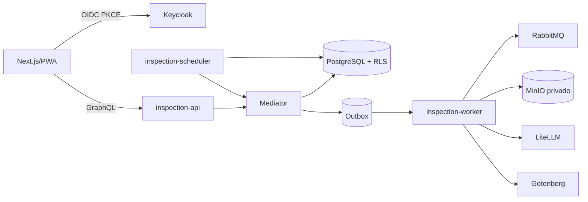

# Arquitetura

O backend segue Vertical Slice Architecture: cada `internal/features/<domínio>/<operação>` possui entrada `Setup`, fluxo de aplicação, regras, persistência e testes. `internal/platform` contém preocupações transversais; `cmd` é o composition root.

A API registra GraphQL e `/healthz`, `/readyz`, `/metrics`. O worker executa dispatcher e consumer em background. O scheduler materializa agendas, lembretes e retenção a cada minuto. Contexto carrega tenant, principal, correlação e idempotência até as transações.
