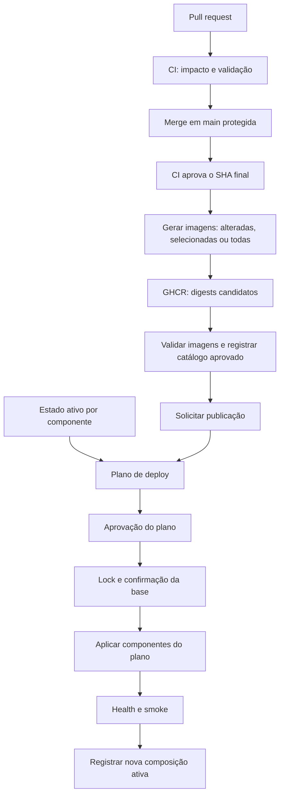

# Estudo de CI, imagens e deploy por componente

Data: 5 de outubro de 2026. Status: workflows, planejador e executor seletivo foram implementados no repositório; habilitação depende da configuração protegida no GitHub/OCI e de aceite em QA.

Base examinada: commit `c8bbdc8cfe28adbc9dbf2bee789ccbda838e267c`, arquivos locais de deploy e consultas somente leitura ao GitHub. Já havia alterações locais em `ci.yml`, no inventário do design system e em `docs/development.md`; elas foram consideradas na leitura e preservadas. A VM de produção não foi acessada: a versão efetivamente ativa, seus digests e a configuração real ainda precisam ser inventariados antes da migração do processo.

## 1. Recomendação

Organizar o fluxo em três responsabilidades: validar código, produzir imagens e aplicar uma composição de versões em um ambiente. Oferecer dois workflows operacionais com seleção de escopo, além da CI:

| Workflow proposto | Entrada principal | Resultado |
| --- | --- | --- |
| `ci.yml` | Pull request ou push em `main` | Validações Go, frontends, E2E, OCI, Terraform e check final `ci-required` |
| `build-images.yml` — Build OCI candidates | CI bem-sucedida em `main` ou dispatch; escopo `changed`, `selected` ou `all` | Imagens ARM64 no GHCR, SBOM/proveniência e release candidata por execução |
| `publish.yml` — Publish to production | Candidato, escopo e `dry_run` | Plano com hash, aprovação no Environment, aplicação seletiva e snapshot do estado |
| `rollback.yml` — Roll back production components | ID de estado anterior e componentes | Plano seletivo de recuperação sem downgrade do banco |
| `sync-production-state.yml` | Dispatch protegido | Lê o recibo sanitizado no host e cria snapshot de estado versionado |

O workflow de build usa uma matriz e um catálogo compartilhado em `deploy/oci/components.json`; `publish.yml` pode também ser chamado como workflow reutilizável por `rollback.yml`. O planejador local está em `deploy/oci/planner.py`; o executor remoto seletivo está em `deploy/oci/host/apply-plan.sh`.

| Ideia inicial | Como fica na proposta |
| --- | --- |
| Gerar uma imagem específica | `build-images.yml`, `scope=selected`, `targets=admin`, por exemplo |
| Gerar todas as imagens | `build-images.yml`, `scope=all` |
| Publicar um componente específico | `publish.yml`, `scope=selected`, `targets=admin`, primeiro `dry_run=true` |
| Publicar todos os componentes | `publish.yml`, `scope=all`; candidato precisa conter todos os nove |
| Identificar serviços alterados | `affected.py` combina catálogo, diff Git e dependências transitivas via `go list` |

Aqui, **publicar imagem no registry** significa enviar o artefato ao GHCR; **publicar em produção** significa ativar esse digest na VM. Recomendo construir e enviar ao GHCR na mesma execução. Separar esses dois atos exigiria exportar/importar imagens grandes entre jobs ou runs, acrescentando custo e outro artefato para controlar. A aprovação operacional fica antes da ativação em produção. Builds de PR podem validar sem permissão de push.

Se quatro botões separados forem uma preferência operacional, criar wrappers pequenos: `images-one.yml`, `images-all.yml`, `deploy-one.yml` e `deploy-all.yml`. Cada um deve apenas fornecer parâmetros à implementação compartilhada. GitHub oferece `workflow_call` e permite utilizá-lo com matrizes. [Documentação de workflows reutilizáveis](https://docs.github.com/en/actions/how-tos/reuse-automations/reuse-workflows).

Cada execução da matriz deve emitir metadados próprios do componente; um agregador confere se todos os resultados esperados existem e passaram. Não usar um único output de matriz para acumular digests: o output de um workflow reutilizável executado em matriz pode refletir somente a última execução bem-sucedida que o definiu. [Outputs de workflows reutilizáveis](https://docs.github.com/en/actions/how-tos/reuse-automations/reuse-workflows#using-outputs-from-a-reusable-workflow).

## 2. O que existe hoje e o que precisa mudar

| Evidência examinada | Comportamento atual | Consequência para a proposta |
| --- | --- | --- |
| [CI](../.github/workflows/ci.yml) | PRs e pushes para `main`; Go, frontends, design system e jornadas integradas | Manter a cobertura e criar um resultado final obrigatório, mesmo quando alguns jobs não são necessários |
| [Workflow OCI antigo](../.github/workflows/oci-images.yml) | Dispatch manual com SHA; publica o formato monolítico antigo | Mantido temporariamente para a migração; novo fluxo está em `build-images.yml` |
| Jobs `publish-api` e `validate-go` | Ambos dependem de `validate-inputs`, mas o build da API não aguarda `validate-go` | Uma imagem pode chegar ao registry antes de uma validação falhar; somente artefatos aprovados devem poder ser promovidos |
| `release-artifact` | Exige todos os digests e `validate-go`, mas não a CI completa | Vincular elegibilidade ao commit e à política de validação; sucesso do build isolado não basta |
| [Dockerfile Go](../deploy/oci/Go.Dockerfile) e [Compose OCI](../deploy/oci/compose.yaml) | API, worker, scheduler e ferramentas operacionais têm referências de imagem separadas; fallback legado mantém a migração possível | Publicação independente com plano coordenado para incompatibilidades |
| [Executor](../deploy/oci/host/apply-plan.sh) | Pull e recriação dos alvos do plano; migration somente quando explicitamente exigida | A recuperação conserva digests não selecionados e nunca reverte o banco |
| Tratamento de erro do executor | Após certas fases, para todos os serviços da aplicação | Uma falha no Admin não poderá derrubar Dashboard, Capture e backend no futuro fluxo parcial |
| [Verificador](../deploy/oci/verify-release.py) | Exige SHA de 40 caracteres, dez referências de imagem e bundle correspondente ao commit | Versionar o formato; representar versões diferentes por componente sem perder verificação de origem |
| Manifesto atual | Um `RELEASE_SHA` identifica a release inteira | Separar ID da implantação, SHA do bundle e SHA de origem de cada imagem |
| Resolução de imagens externas | Reconsulta tags de PostgreSQL, RabbitMQ, Dragonfly e Caddy em cada build | Fixar digests aprovados em um lock de infraestrutura; atualização deve ser explícita |
| Bind mounts relativos | PostgreSQL, Keycloak e Caddy usam arquivos do diretório da release | Uma nova pasta de release muda caminhos absolutos e pode causar recriação mesmo com conteúdo igual |
| Tema Keycloak | Está dentro da imagem e também montado por bind mount | O arquivo montado prevalece; imagem e configuração precisam ter uma fonte canônica |
| [Atualização de segredos](../deploy/oci/host/secrets-refresh.sh) | Reescreve configuração global e arquivo do realm | Detectar configuração e rotação separadamente; uma release parcial não pode declarar aplicado o que não foi ativado |
| [Instalador de ferramentas](../deploy/oci/host/install-host-tools.sh) | Ativado pelo operador antes de entrar no lock do executor | Lock precisa abranger também ativação de ferramentas e atualização de configuração |
| Retenção de Actions | Digests intermediários por 30 dias; bundle final por 90 | Garantir retenção durável de artefatos ainda ativos ou necessários para rollback |

O desenho já tem proteções úteis: referências por digest, checksum, comparação dos arquivos do bundle com o Git, verificação de arquitetura, lock local, health checks e recusa de rollback incompatível. A evolução deve preservar essas propriedades.

Consultas ao GitHub nesta data mostraram:

- Repositório `luarsistemas-hub/inspection` público, `main` com `protected=false`, lista de rulesets vazia e nenhum environment configurado.
- A [publicação de imagens de `b295d3b`](https://github.com/luarsistemas-hub/inspection/actions/runs/37258392677) terminou com sucesso, enquanto a [CI do mesmo commit](https://github.com/luarsistemas-hub/inspection/actions/runs/37258323034) falhou. Isso confirma a ausência de vínculo entre os gates; não informa qual versão está em produção.
- Na [CI mais recente consultada](https://github.com/luarsistemas-hub/inspection/actions/runs/37290851200), a validação do inventário do design system falhou e os E2E dependentes ficaram sem execução. Há alterações locais relacionadas a esse gate; não as substituí.
- O job `cross-product` ainda referencia `.env.inspection` antes do passo que o cria. O arquivo não é versionado. É um problema de ordenação verificável na definição, distinto da falha observada no run acima.
- O build bem-sucedido levou aproximadamente 8min37s. Os quatro jobs de frontend levaram entre 6min42s e 7min31s cada. Seleção reduz trabalho agregado; não implica reduzir o tempo total na mesma proporção, pois eles já rodam em paralelo.

## 3. Unidades de publicação

| Unidade inicial | Artefato | Serviços atingidos | Política |
| --- | --- | --- | --- |
| `api` | `inspection-api` | `inspection-api` | Independente quando contrato/schema compatível |
| `worker` | `inspection-worker` | `inspection-worker` | Independente quando eventos/schema compatíveis |
| `scheduler` | `inspection-scheduler` | `inspection-scheduler` | Independente; encerramento limitado e context-aware |
| `operations` | `inspection-operations` | Sem container permanente; migrador, seeds e checks | Executado apenas por plano coordenado |
| `admin` | `inspection-admin` | Admin | Independente quando compatível com a API ativa |
| `dashboard` | `inspection-dashboard` | Dashboard | Independente quando compatível com API e fluxos de Capture |
| `capture` | `inspection-capture` | Capture | Considerar clientes PWA já carregados e contratos de upload |
| `onboarding` | `inspection-onboarding` | Onboarding | Considerar API e configurações Turnstile/OIDC |
| `keycloak` | `inspection-keycloak` e configuração versionada | Keycloak | Tema vem da imagem; configuração de realm continua sob controle do host |
| `infrastructure` | Digests externos e Terraform | PostgreSQL, filas, cache, Caddy, recursos OCI | Digests fixados em `base-images.lock`; não mudam em `all` |

Definição de `all`: os nove artefatos próprios (`api`, `worker`, `scheduler`, `operations`, quatro frontends e `keycloak`). `operations` não é um serviço permanente. O plano lista exatamente os containers que serão recriados. Atualizações de infraestrutura exigem alteração explícita de `base-images.lock`.

API, worker, scheduler e ferramentas operacionais têm imagens independentes, construídas pela receita comum `Go.Dockerfile`. O mesmo digest não é implicitamente promovido entre processos; o planejador só herda componentes que não foram selecionados.

## 4. Fluxo proposto



O build automático já é disparado por `workflow_run` após sucesso da CI em `main`; o workflow confirma repositório, branch e SHA do run concluído. Também há dispatch manual com SHA alcançável a partir de `main`. PRs não recebem permissão para publicar imagens. A publicação em produção promove digests já construídos, sem rebuild.

Para disparo automático via `workflow_run`, conferir conclusão, evento `push`, repositório de origem, branch `main` e `head_sha` do run que terminou. O SHA padrão do novo workflow não representa necessariamente o commit validado. Nunca promover um artifact de PR não confiável por esse caminho. O GitHub documenta que esse evento pode obter privilégios superiores aos do workflow anterior. [Eventos de workflows](https://docs.github.com/en/actions/reference/workflows-and-actions/events-that-trigger-workflows).

O workflow `workflow_run` é mantido separado da CI para evitar transferir permissões de publicação ao código do PR. O caminho verifica `head_sha` do run concluído antes de fazer checkout e build.

## 5. Detecção de impacto

O catálogo versionado está em `deploy/oci/components.json`; `deploy/oci/affected.py` é o resolvedor testável fora do GitHub. Ele descreve caminhos por componente, regras compartilhadas, os nove targets e caminhos explicitamente ignorados.

O resolvedor seleciona apenas builds. Caminhos desconhecidos bloqueiam a seleção automática. Para Go, `go list -deps -json` compara arquivos de cada executável, incluindo arquivos embutidos e módulos compartilhados. As regras GraphQL selecionam backend e quatro frontends. O planejador separa targets de deploy, digests herdados e operações de migration.

Mapa inicial conservador:

| Caminho/entrada alterada | Build inicialmente afetado | Validação ou ação adicional |
| --- | --- | --- |
| `apps/admin/**` | Admin | Jornadas Admin relevantes |
| `apps/dashboard/**` | Dashboard | Jornada Dashboard → Capture quando relacionada |
| `apps/capture/**` | Capture | Upload, recaptura, PWA e compatibilidade com cliente anterior |
| `apps/onboarding/**` | Onboarding | Cadastro, API e Turnstile |
| `packages/inspection-design-system/**` | Quatro frontends | Testes do pacote e jornadas dos consumidores |
| `packages/inspection-address/**` | Admin e Onboarding | Testes do pacote e dos dois consumidores |
| `scripts/prepare-design-system.mjs` | Quatro frontends | Preparação, empacotamento e builds |
| `services/inspection/**` | Processos Go dependentes por executável | Testes Go e contratos afetados |
| `services/inspection/schema.graphqls` | Backend e quatro frontends | Codegen, compatibilidade GraphQL e jornadas integradas |
| `libs/**`, `go.mod`, `go.sum`, `go.work`, `go.work.sum` | Executáveis Go que importam dependência alterada | Consumidores Go e compilação ARM64 |
| `deploy/keycloak/themes/**`, `deploy/oci/Dockerfile.keycloak` | Keycloak | Login e tema |
| `deploy/oci/keycloak-realm.json` | Não implica rebuild da imagem atual | Plano de configuração do realm; não basta reiniciar Keycloak |
| `deploy/oci/compose.yaml`, Dockerfiles e `base-images.lock` | Imagens que consomem a receita ou composição alterada | Revalidação do bundle e da composição |
| `deploy/oci/host/**`, `ops.sh`, Terraform, testes e docs | Nenhuma imagem por si só | Gate operacional/Terraform ou documentação |
| `deploy/oci/foundation/**`, `runtime/**` | Nenhuma imagem por si só | Terraform validate e Plan em fluxo de infraestrutura |
| `.dockerignore`, política/catálogo de build, workflow reutilizável | Alvos consumidores; todos quando não for possível determinar | Invalidar o fingerprint correspondente e revisar o pipeline |
| Variáveis públicas usadas no build | Frontends consumidores | Rebuild mesmo sem alteração de Git |
| Digests de imagens-base e toolchain | Imagens consumidoras | Rebuild programado ou acionado pela atualização do lock |
| Documentação sem uso por build/teste | Nenhuma imagem | Validação documental |

O schema entra no build dos quatro apps: seus Dockerfiles copiam esse arquivo e `prebuild` executa codegen. Portanto, excluí-lo da detecção por ser “arquivo do backend” seria incorreto. Documentos que alimentam gates, como o inventário do design system, também não devem ser ignorados genericamente.

As bases de comparação são diferentes:

1. **PR:** comparar a base comum com o head da alteração; executar também os testes sobre a composição de merge adequada ao evento. Registrar os dois SHAs para não confundir código proposto com o merge sintético testado.
2. **Build:** comparar os inputs completos do componente no commit candidato com os do último artefato válido desse componente. `HEAD~1` ou o último push não cobrem builds falhos, cancelados ou pulados.
3. **Deploy:** comparar digests e configurações desejados com o estado efetivamente ativo por componente. O último workflow bem-sucedido não é necessariamente o último deploy.

O fingerprint de build deve incluir arquivos consumidos, lockfiles, Dockerfile, imagens-base fixadas, arquitetura, toolchain, versão da receita e argumentos públicos de build. Não incluir valores secretos no catálogo. Em uma primeira implementação, mapas de paths conservadores são suficientes; fingerprints permitem reaproveitamento preciso depois.

Fixar imagens-base por digest requer também um processo de atualização: mudanças revisáveis do lock e rebuild periódico dos consumidores evitam congelar correções de segurança indefinidamente. Essa política vale tanto para `FROM` dos Dockerfiles quanto para as imagens externas do Compose. [Boas práticas de build do Docker](https://docs.docker.com/build/building/best-practices/).

Tratar renomeações e exclusões, usar diff completo com saída delimitada por NUL e disponibilizar o histórico Git necessário. Se um caminho relevante não estiver classificado, interromper o planejamento ou ampliar explicitamente o build; nunca concluir silenciosamente “nada mudou”. Uma mudança sem impacto comprovado deve aparecer como `no-op` com motivo.

Não usar filtros de paths no topo como única decisão de uma CI obrigatória. Eles têm limites de diff; a documentação consultada nesta data informa 3.000 arquivos. Executar sempre o planejador e um job final `ci-required`, que confirme sucesso de todos os jobs exigidos e aceite `skipped` apenas quando previsto no plano. [Sintaxe e filtros do GitHub Actions](https://docs.github.com/en/actions/reference/workflows-and-actions/workflow-syntax).

O fingerprint combina fontes consumidas, lockfiles, Dockerfile, catálogo, Compose, lock de imagens-base, arquitetura e argumentos públicos específicos de cada frontend. Artefatos de base não são automaticamente reutilizados ainda: componentes não alterados são herdados do estado aplicado, enquanto builds solicitados publicam candidatos novos.

## 6. Artefatos e identidade da implantação

O modelo deve distinguir três registros:

- **Catálogo de imagens:** resultado do build; informa quais componentes existem, digests, source SHA, plataforma, perfil, inputs e evidências de validação. Pode conter somente Admin.
- **Plano de implantação:** snapshot completo de estado desejado, derivado do estado ativo e do catálogo. Lista os componentes que serão alterados, a base esperada, migrações e checks.
- **Registro aplicado:** resultado observado após a execução, com status, horários, digests e configurações efetivamente ativos. A existência de um plano não comprova deploy.

Exemplo abreviado de plano; os demais componentes também devem constar no documento real:

```json
{
  "formatVersion": 2,
  "deploymentId": "prod-<run-id>-<attempt>-<manifest-hash>",
  "parentDeploymentId": "prod-<previous-id>",
  "expectedCurrentManifestDigest": "sha256:<base-digest>",
  "environment": "production",
  "changedComponents": ["admin"],
  "platformBundle": {
    "sourceSha": "<sha-do-bundle-aprovado>",
    "digest": "sha256:<bundle-digest>"
  },
  "components": {
    "admin": {
      "image": "ghcr.io/luarsistemas-hub/inspection-admin@sha256:<novo-digest>",
      "sourceSha": "<sha-da-imagem-admin>",
      "buildProfile": "production",
      "buildInputsDigest": "sha256:<inputs>",
      "validationRunId": "<run-id>"
    },
    "backend": {
      "image": "ghcr.io/luarsistemas-hub/inspection-api@sha256:<digest-ativo>",
      "sourceSha": "<sha-da-imagem-backend>",
      "buildInputsDigest": "sha256:<inputs-ativos>"
    }
  },
  "migration": { "required": false }
}
```

Usar um ID novo para cada composição ou rebuild. Reexecutar o mesmo SHA com outros argumentos ou bases pode produzir outro digest; SHA do Git sozinho não identifica um build. A release atual recusa sobrescrita divergente e o novo formato deve preservar essa recusa.

Registrar a configuração pública por componente, versão de ferramentas, versões/identificadores de segredos necessários e intervalo de schema suportado. Manter detalhes sensíveis em armazenamento protegido; registros públicos devem ser reduzidos aos metadados apropriados. Checksums verificam conteúdo, mas não comprovam por si só que um workflow confiável produziu a imagem.

Adicionar proveniência e SBOM, verificar origem do workflow, repositório, commit e digest na promoção. O workflow atual não declara SBOM nem verificação de attestations; isso não significa ausência de proveniência, pois Buildx pode produzi-la por padrão. [Attestations do Docker](https://docs.docker.com/build/ci/github-actions/attestations/) e [attestations do GitHub](https://docs.github.com/en/actions/concepts/security/artifact-attestations).

Guardar catálogos, bundles e planos aprovados além dos 90 dias de artifacts. Uma opção é um GitHub Release imutável para metadados não sensíveis; outra é armazenamento privado com retenção definida. GitHub recomenda montar a release como draft, anexar todos os assets e publicá-la depois. Isso não torna os pacotes GHCR automaticamente imutáveis: continuar usando digests e uma política explícita de retenção. [Releases imutáveis](https://docs.github.com/en/code-security/concepts/supply-chain-security/immutable-releases).

Em publicação parcial, `previous` significa a composição anterior inteira. Recuperar somente Admin deve herdar todos os outros componentes do estado atual e trocar apenas o digest/configuração do Admin. Não substituir o ambiente inteiro por um manifesto histórico por acidente.

## 7. Planejamento e execução na VM

Antes de executar, mostrar um plano como:

```text
Ambiente: production
Base esperada: deployment-123
Admin: digest A -> digest B
Demais componentes: herdados da base
Serviços a recriar: admin
Migration: não
Mudança em infraestrutura/configuração compartilhada: não
Checks: health do Admin + jornada afetada + smoke global de leitura
Recuperação prevista: digest A e configuração anterior do Admin
```

Algoritmo proposto:

1. Ler estado ativo, imagens observadas e configuração; falhar diante de drift não explicado.
2. Resolver o pedido e suas dependências. Recusar seleção incompleta quando ela depender de contratos ainda indisponíveis.
3. Construir snapshot completo e imutável do estado desejado. Validar as imagens herdadas e a combinação final.
4. Aprovar o plano vinculado ao hash desse snapshot.
5. Adquirir lock global no host e conferir novamente `expectedCurrentManifestDigest`. Se a base mudou enquanto aguardava, invalidar o plano e produzir outro para revisão; não sobrescrever o deploy mais recente.
6. Baixar somente as imagens necessárias, validar configuração e preparar arquivos protegidos sem promover o estado ativo.
7. Executar o ramo correspondente: frontend, backend coordenado ou plataforma.
8. Verificar saúde, comportamento afetado e estado global. Promover o registro somente após sucesso.
9. Em falha, registrar fase, componentes tocados e resultado da recuperação. Distinguir preflight, aplicação parcial, migração e falha posterior.

Para frontend independente, o executor usará conceitualmente `docker compose up -d --no-deps --wait admin`, com manifesto validado e dependências saudáveis. Esse comando isolado não substitui o processo: por fora dele faltariam auditoria, base esperada e recuperação. Compose recria serviços quando imagem ou configuração muda. Uma única réplica pode ficar brevemente indisponível durante a troca; deploy seletivo não garante ausência de interrupção. [Referência de `compose up`](https://docs.docker.com/reference/cli/docker/compose/up/).

Preservar o nome do projeto Compose `inspection`; um nome por release criaria outra stack e poderia duplicar workers/scheduler. Para zero downtime futuro, avaliar roteamento entre duas réplicas web e capacidade adicional; o runtime declarado tem 2 OCPUs e 12 GB. Scheduler e consumidores precisam de estratégia própria contra trabalho duplicado.

Corrigir o acoplamento dos bind mounts: manter assets imutáveis em caminhos identificados pelo conteúdo, ou preservar a referência de configuração herdada. Para Keycloak, preferir o tema embutido na imagem e remover a duplicidade em uma migração controlada. A coleta de lixo deve preservar todos os bundles ainda referenciados por containers, não somente duas pastas de release.

O lock deve proteger deploy, rollback, instalação de ferramentas e refresh de configuração. Não basta colocar o lock depois de substituir o executável que os outros comandos usam. No GitHub, usar um grupo global por ambiente, e não um por componente, porque banco, Compose e registro de estado são compartilhados.

```yaml
concurrency:
  group: inspection-production
  cancel-in-progress: false
  queue: max
```

Na documentação atual, `queue: max` permite até 100 pendências; o padrão permite uma e substitui a anterior. Confirmar suporte no validador usado pelo projeto antes de adotar a propriedade, pois o `actionlint` atual está fixado em versão antiga. A fila não elimina a validação da base ativa. [Concorrência no GitHub Actions](https://docs.github.com/en/actions/reference/workflows-and-actions/workflow-syntax#concurrency).

Timeout ou cancelamento do runner não deve deixar uma migration sem dono. Recomendo execução supervisionada na VM, com ID persistente, lock e consulta de status, de forma que uma queda de SSH permita reconectar e observar o mesmo deploy. Não repetir automaticamente uma operação cujo resultado ficou desconhecido.

## 8. Backend, migrations e contratos

O projeto tem banco e contratos de eventos compartilhados. API, worker e scheduler têm imagens independentes, conforme decisão de implementação. Se houver alteração de banco, o plano exige atualização coordenada dos três processos Go e da imagem `operations`; mudanças de contrato não verificadas exigem a composição completa.

Não detectar migrations apenas por `migrations/planner.go`: o migrador também executa `AutoMigrate(Models())`, reparos e seeds. Alterações em `models.go`, `migrator.go`, SQL e código operacional precisam entrar na classificação. Para o primeiro rollout seletivo, recomendo manter a execução do migrador em toda publicação de backend e eliminá-la apenas dos deploys exclusivamente de frontend, após os checks de compatibilidade.

`SchemaMax` assume `migrations.LatestVersion()` em cada binário. Isso significa que uma imagem antiga pode recusar readiness após a aplicação de uma nova versão, mesmo que a mudança SQL pareça aditiva. Não ampliar esse limite por variável apenas para permitir rollback; a compatibilidade precisa ser demonstrada.

Antes de separar versões de API/worker/scheduler, exigir:

- Compatibilidade de todos os processos que continuarão ativos com o schema resultante.
- Evolução de eventos que permita consumir mensagens antigas e novas durante a transição.
- Mudanças de GraphQL que mantenham clientes anteriores funcionando, inclusive abas abertas e Capture PWA.
- Migrações em etapas: adicionar estrutura compatível, migrar consumidores/dados e remover estruturas antigas em publicação posterior.
- Testes de upgrade com dados representativos e testes do retorno de aplicação contra o banco já migrado.

Rollback de aplicação não reverte PostgreSQL. Após falha em fase mutável, manter o bloqueio conservador do backend e corrigir avançando quando a versão anterior não for comprovadamente compatível. Para frontend isolado sem mudança de schema/plataforma, uma recuperação automática do componente pode ser habilitada após teste específico; falhas globais não devem provocar reversões arbitrárias de componentes saudáveis.

O runbook atual declara uma VM sem failover e sem backup de recuperação. Essa limitação precisa entrar no planejamento de alterações de banco e infraestrutura. Um mecanismo de backup com teste de restauração é uma frente operacional anterior a migrations de maior risco, não uma propriedade fornecida pelo novo workflow.

Dois casos não são resolvidos por trocar imagens:

- O prompt padrão já persistido não é substituído pelo seed normal. Publicar mudança em `default_system_prompt.go` exige uma operação de produto/seed explícita, conforme [README do serviço](../services/inspection/README.md).
- O import de Keycloak no startup pula realms existentes. Evolução de clientes, roles e configurações do realm exige migração idempotente própria; alterar o JSON e reiniciar não garante aplicação. [Documentação do Keycloak](https://www.keycloak.org/server/importExport).

## 9. Validar a imagem e a combinação que será implantada

A CI atual valida o código e builds locais, mas isso não certifica automaticamente a imagem final ARM64 com os argumentos de produção. O workflow de imagens ainda faz `npm run build` antes de outro build dentro do Docker. Otimizar essa repetição só depois de garantir a cobertura do artefato final.

Fluxo recomendado: testes de fonte aprovados → build ARM64 candidato → push com identificação única → pull pelo digest → checks da imagem → registro de elegibilidade. Uma imagem candidata reprovada pode existir no registry, mas não pode aparecer como release promovível. O deploy consome o mesmo digest validado. Docker documenta um padrão de teste de imagens antes da publicação; a exigência deste projeto é que a identidade final validada seja a mesma promovida. [Teste de imagens no GitHub Actions](https://docs.docker.com/build/ci/github-actions/test-before-push/).

Para uma publicação parcial, testar a composição candidata com os digests herdados da produção. “Tudo passou no commit novo” não comprova que um frontend novo funciona com uma API antiga. Começar com contract tests e jornadas críticas da composição mista, conservando o E2E amplo para mudanças compartilhadas e releases completas.

Os frontends usam `NEXT_PUBLIC_*` no build. Esses valores ficam incorporados no JavaScript e não mudam apenas ao alterar o ambiente do container. Portanto, registrar o perfil público no catálogo e impedir que uma imagem de homologação seja promovida como produção sem verificar esse perfil. [Variáveis de ambiente do Next.js](https://nextjs.org/docs/app/guides/environment-variables).

Para testar o digest final com URLs de produção, usar ambiente de QA isolado com DNS/roteamento de teste e saída de rede controlada, garantindo que browser e containers alcancem somente doubles/serviços QA. Até isso existir, explicitar a diferença entre E2E da variante QA e smoke do artefato final. Outra evolução é mover a configuração pública para runtime; isso permite promover a mesma imagem entre ambientes, mas exige mudança deliberada nos apps.

A UI de aprovação deve mostrar: digests atuais/novos, origem, evidências, componentes herdados, risco de interrupção, migration e forma de recuperação. O smoke atual cobre containers, HTTP, OIDC e privacidade do storage; não comprova sozinho login completo, envio de e-mail, upload, filas ou uma jornada de negócio.

## 10. Acesso à produção e proteção do fluxo

Criar um environment `production`, restringir branches e configurar aprovação compatível com o tamanho da equipe. Como o repositório consultado é público, os recursos de environments estão disponíveis nos planos atuais documentados. Se a visibilidade mudar, revisar a disponibilidade dessas regras. [Environments do GitHub](https://docs.github.com/en/actions/how-tos/deploy/configure-and-manage-deployments/manage-environments).

Proteger `main` com CI obrigatória e revisão de alterações do catálogo, workflows e executor. Permissões devem ser por job: validação somente leitura, build com escrita de pacotes apenas onde necessário e publicação de metadados/deploy com os acessos específicos. Fixar Actions externas por SHA e manter atualização revisável. Evitar executar código de PR com credenciais ou conectividade de produção. [Uso seguro do GitHub Actions](https://docs.github.com/en/actions/reference/security/secure-use).

O runtime OCI expõe SSH apenas ao CIDR administrativo. Runners GitHub comuns não têm um endereço fixo que já caiba nessa regra. O transporte aprovado para Actions é WireGuard com rota limitada ao endereço da VM; o workflow usa credenciais de produção somente no job protegido após mostrar o plano. O CLI local compartilha o planejador e o executor como caminho de operação/recuperação.

Para passar a execução integral ao Actions, escolher e testar uma destas opções:

| Opção | Benefício | Custo/limite |
| --- | --- | --- |
| Runner hospedado com túnel privado controlado | Runner efêmero; acesso temporário à rede da VM | Exige provisionar/revogar acesso e manter a solução de rede |
| Larger runner com IP estático | Integração simples com allowlist SSH | Depende do plano e de orçamento |
| Executor de operações isolado em contexto privado | Mantém acesso de rede sob controle próprio | Exige infraestrutura, atualização e fronteira de confiança próprias |

GitHub documenta redes privadas por overlay e desaconselha permitir todas as faixas dos runners comuns em recursos internos. [Rede privada](https://docs.github.com/en/enterprise-cloud%40latest/actions/concepts/runners/private-networking) e [endereços dos runners](https://docs.github.com/en/actions/reference/runners/github-hosted-runners).

Não recomendo instalar um runner genérico na própria VM de produção nem associá-lo a jobs de PR deste repositório público. A execução de produção deve ser uma operação estreita: aplicar um plano validado, sem executar builds ou scripts arbitrários enviados por PR. O GitHub destaca a exposição de runners próprios em repositórios públicos. [Segurança de runners próprios](https://docs.github.com/en/actions/reference/security/secure-use#hardening-for-self-hosted-runners).

Manter segredos de aplicação no OCI Vault e recuperação via Instance Principal no host. O registry usa permissão de leitura na produção. O transporte precisa de identidade própria e verificação de chave do host. Não pressupor que o OIDC do GitHub autentica automaticamente o SSH ou o Vault OCI; isso exigiria uma integração separada e validada.

## 11. Comandos e interfaces implementados

Build manual no branch `main`:

```sh
gh workflow run build-images.yml --ref main \
  -f source_sha="$SHA" -f scope=selected -f targets=admin

gh workflow run build-images.yml --ref main \
  -f source_sha="$SHA" -f scope=all
```

`changed` usa a última release `candidate-*` como base quando disponível. O workflow automático usa o SHA exato do `workflow_run` bem-sucedido em `main`. Os builds publicam digests no GHCR e uma release única `candidate-<run>-<attempt>`. Candidatos podem conter digests reutilizados de builds anteriores com fingerprint compatível.

Prévia e aplicação de produção são execuções separadas:

```sh
gh workflow run publish.yml --ref main \
  -f operation=deploy -f candidate_id="$CANDIDATE_ID" \
  -f scope=selected -f targets=admin -f dry_run=true

gh workflow run publish.yml --ref main \
  -f operation=deploy -f candidate_id="$CANDIDATE_ID" \
  -f scope=selected -f targets=admin -f dry_run=false
```

Para todos os componentes, escolha `scope=all`; para publicar o conjunto selecionado pelo resolvedor, escolha `changed`. O plano é criado antes da aprovação e fica vinculado ao hash e à base esperada. A aprovação do Environment `production` antecede o acesso ao túnel.

Rollback pelo workflow dedicado:

```sh
gh workflow run rollback.yml --ref main \
  -f deployment_id="$DEPLOYMENT_ID" -f targets=admin -f dry_run=true
```

Depois de revisar o plano, repita com `dry_run=false`. O rollback cria uma composição nova e nunca faz downgrade do banco. `sync-production-state.yml` atualiza o snapshot sanitizado a partir do recibo no host.

A CLI local usa os mesmos artefatos e regras. `ACTIVE.env`, `CANDIDATE.json`, `PREVIOUS.env`, o plano e o bundle de código devem estar disponíveis no caminho local informado:

```sh
deploy/oci/ops.sh plan ACTIVE.env CANDIDATE.json admin /tmp/plan.json
deploy/oci/ops.sh apply /tmp/plan.json /tmp/source-bundle.tgz
deploy/oci/ops.sh rollback-plan ACTIVE.env PREVIOUS.env admin /tmp/rollback-plan.json
deploy/oci/ops.sh deployment-status
deploy/oci/ops.sh sync-state current
```

`sync-state` consulta o host pelo acesso restrito. `deployment-status` aceita opcionalmente um ID. O comando legado `ops.sh deploy <SHA>` ainda existe durante a migração; não o use para escrever estado novo depois da ativação do formato versionado.

## 12. Situação da implementação e habilitação

A implementação local cobre os nove componentes, catálogo/resolvedor de impacto, fingerprints, lock de imagens-base, Compose com referências separadas, catálogo/planejador de composição, executor supervisionado no host, workflows de build/publicação/rollback/sincronização, acesso WireGuard e CLI de operação. O workflow antigo permanece apenas para a transição.

Ainda são pré-requisitos externos e não foram executados neste trabalho:

1. Configurar o check `ci-required` e revisão de alterações de CI/CD nas regras de `main`.
2. Cadastrar as variáveis públicas usadas pelos builds de frontend.
3. Configurar o Environment `production`, branch permitida `main`, required reviewer `luarsistemas-hub` e self-review habilitado conforme a decisão do projeto.
4. Cadastrar as credenciais de WireGuard e SSH nos segredos do Environment.
5. Instalar os scripts atualizados, configurar a chave restrita e o peer WireGuard na VM; aplicar a regra UDP 51820 por uma mudança Terraform revisada.
6. Inventariar os digests e configurações realmente ativos, importar o estado sem recriar containers e ensaiar a seleção e recuperação em QA.
7. Após ativação e ensaio, bloquear os caminhos legados de deploy que alterem estado sem recibo.

Não foi acessada a VM, não foi aplicado Terraform e não foram alteradas configurações do GitHub. Até cumprir os pré-requisitos e executar o aceite em QA, os workflows são implementação versionada, não evidência de deploy end-to-end.

## 13. Matriz mínima de validação

| Cenário | Resultado exigido |
| --- | --- |
| Alteração só no Admin | Admin é o alvo sugerido; publicação não recria backend ou outros frontends |
| Alteração só no worker | Worker é o alvo sugerido; API e scheduler conservam instâncias |
| Pacote de endereço/design system | Admin+Onboarding / quatro frontends são selecionados |
| Schema GraphQL ou evento | Consumidores afetados são validados; incompatibilidade bloqueia seleção parcial |
| Migration ou `AutoMigrate` | Exige API, worker, scheduler e operations coordenados |
| Build anterior falhou ou foi pulado | Fingerprint compara com o último candidato válido; mudança acumulada não se perde |
| Arquivo desconhecido | Seleção automática falha com diagnóstico |
| Mudança em argumento público ou imagem-base | Fingerprint invalida a imagem anterior |
| CI falhou, SHA de fork ou não alcançável por `main` | Build candidato não é publicado |
| Job obrigatório pulado | `ci-required` falha |
| Dois planos sobre a mesma base | Segundo apply é rejeitado após alteração do estado |
| Falha antes/depois de migration | Recupera somente componentes tocados quando seguro; sem downgrade do banco |
| Queda de SSH durante apply | Operação systemd continua e status pode ser consultado pelo ID |
| Regressão no Admin | Recuperação de Admin mantém restantes componentes ativos |
| Tunnel/SSH indisponível ou host key incorreta | Nenhum acesso fora do host restrito e nenhuma promoção de estado |

Aceite principal ainda pendente: em QA, publicar e recuperar Admin e worker separadamente, provar por IDs de containers que os outros serviços não foram recriados e confirmar que nenhuma migration indevida rodou.

## 14. Verificação registrada

A primeira investigação encontrou CI sem vínculo seguro com o workflow OCI, referência monolítica de API para vários processos e ausência de estado seletivo por componente. A implementação atual altera esses pontos e mantém `docs/ci-cd-study.md` como registro da arquitetura e do rollout.

Validações locais devem ser executadas novamente após as últimas mudanças antes de considerar a implementação entregue: suíte Python OCI, `actionlint`, Compose config, Terraform format/validate, sintaxe shell, `git diff --check` e os gates Go exigidos pelo repositório. Nenhum build final ARM64, aplicação real em QA ou produção foi executado nesta etapa.
