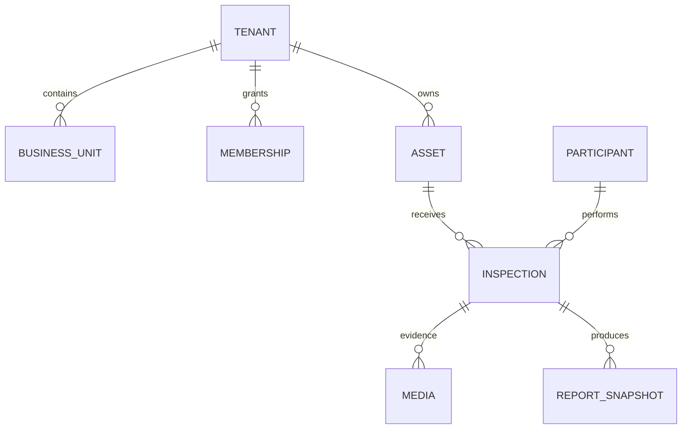

# Banco de dados e isolamento

PostgreSQL é aberto por `database.Open`; somente `inspection-migrate` chama `Migrator.Migrate`. O migrador cria schemas, executa `AutoMigrate` aditivo e aplica passos versionados em `platform.schema_migrations` com checksum e lock transacional. A janela compatível padrão é 13 a 19.

Schemas funcionais: `tenancy`, `access`, `participants`, `segments`, `templates`, `assets`, `origins`, `schedules`, `inspections`, `projects`, `capture`, `media`, `invitations`, `recapture`, `analysis`, `reports`, `notifications`, `retention`, `dashboard`, `usage`, `audit` e `messaging`.

`inspection_runtime` é `NOINHERIT`, não possui `BYPASSRLS` e recebe apenas DML nos schemas da aplicação. `inspection_worker` possui `BYPASSRLS` para consumir e projetar eventos. Tabelas tenant-scoped têm RLS habilitado e `FORCE ROW LEVEL SECURITY`; o contexto de tenant é definido antes das consultas.

`Compatible` impede que API e scheduler fiquem prontos fora da janela declarada. Não use `postgres` em processos de runtime.
