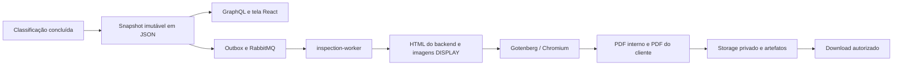
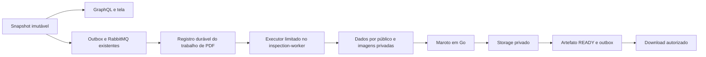

# Estudo de substituição do Gotenberg

Data: 3 de outubro de 2026. Escopo: estudo técnico, sem alteração do runtime ou remoção de containers nesta etapa. Base: chat fornecido, código presente no workspace e documentação primária das bibliotecas. O workspace contém mudanças em andamento; as observações descrevem os arquivos lidos, não necessariamente o último commit.

## 1. Decisão recomendada

**Adotar Maroto v2 para gerar o PDF diretamente do snapshot do laudo, dentro do `inspection-worker`, preservando o processamento assíncrono e o storage privado.** A escolha final depende de uma prova de conceito com laudos representativos, sobretudo fotografias, textos extensos e paginação.

As três alternativas mais alinhadas ao objetivo são:

| Posição | Alternativa | Principal vantagem para o Inspection | Principal custo | Quando escolher |
| --- | --- | --- | --- | --- |
| 1 | Maroto v2 | Composição por linhas, colunas e componentes; boa adequação ao laudo estruturado | Layout passa a ser mantido em Go; dependências transitivas a acompanhar | Escolha inicial para equilibrar simplicidade e controle |
| 2 | gopdf | Controle direto de texto, imagens e coordenadas | Mais código próprio para fluxo, medidas e paginação | Se o protótipo exigir controle visual que torne Maroto inconveniente |
| 3 | UniPDF, usando `creator` | Geração direta e recursos adicionais de documentos em um SDK comercial | Licenciamento e dependência do fornecedor | Se suporte comercial e recursos avançados justificarem o custo |

O ranking é uma avaliação de adequação, não um resultado de benchmark. As três opções permitem construir o documento sem HTML e sem um serviço HTTP de conversão. Maroto e gopdf usam licença MIT; UniPDF é comercial. [Maroto](https://github.com/johnfercher/maroto), [gopdf](https://github.com/signintech/gopdf), [UniPDF](https://github.com/unidoc/unipdf).

**Gerar dentro da aplicação não significa gerar dentro da requisição HTTP.** A aplicação já possui um processo worker adequado para isso. A API continua consultando o estado e entregando a URL de um arquivo pronto.

## 2. O que existe hoje

O PDF não é produzido imprimindo a tela React. Hoje há duas apresentações diferentes alimentadas por dados do laudo: componentes React no dashboard e um template HTML no backend.

Evidências no repositório:

| Evidência | Consequência para a migração |
| --- | --- |
| [`reports/core/core.go`](../services/inspection/internal/features/reports/core/core.go): `Snapshot`, `CanonicalJSON`, `HTMLForPDF` | Já existe representação estruturada com contexto, requisitos, evidências, constatações e classificação |
| [`generate_snapshot/setup.go`](../services/inspection/internal/features/reports/generate_snapshot/setup.go): persiste JSON, HTML e seus digests | PDF pode mudar de motor sem modificar os snapshots já emitidos |
| [`inspection-worker/main.go`](../services/inspection/cmd/inspection-worker/main.go): evento `report.snapshot_created.v1` e composição de `pdf.Gotenberg` | Troca ocorre no caminho assíncrono existente |
| [`render_pdf/setup.go`](../services/inspection/internal/features/reports/render_pdf/setup.go): carrega JSON, imagens e gera `PDF` e `PDF_CUSTOMER` | A implementação precisa preservar dois públicos distintos |
| [`report-visual.tsx`](../apps/dashboard/src/features/dashboard/report-visual.tsx): usa propriedades estruturadas de GraphQL | Não é necessário portar a tela React nem capturar seu DOM |
| [`pdf/pdf.go`](../services/inspection/internal/platform/pdf/pdf.go): interface recebe `io.Reader` com HTML | A interface atual precisa evoluir para dados; trocar só o adapter não elimina o HTML |
| [`schema.resolvers.go`](../services/inspection/internal/platform/graphql/resolvers/schema.resolvers.go): `ReportDownload` | Download já busca artefato e URL temporária; cliente exige publicação e seleciona `PDF_CUSTOMER` |

### Pontos de desempenho e confiabilidade observados

1. **Transação longa:** `messaging.Consumer.Process` chama o handler dentro de uma transação. `render_pdf` faz consultas, leitura de storage, duas renderizações e uploads antes de ela terminar. Isso ocupa uma conexão e prolonga a transação; a existência de fila não elimina esse custo. Ver [`dispatcher.go`](../services/inspection/internal/platform/messaging/dispatcher.go).
2. **Consumo sequencial por fila:** há uma goroutine por contrato de fila, mas cada `RabbitConsumer.Run` processa uma entrega por vez. O `prefetch` configurado em 32 não cria 32 renderizações paralelas. Outras filas têm consumidores próprios, embora compartilhem recursos do processo. Ver [`consume_events/setup.go`](../services/inspection/internal/features/messaging/consume_events/setup.go) e [`consumer.go`](../services/inspection/internal/platform/messaging/consumer.go).
3. **Imagens acumuladas:** `loadDisplayAssets` consulta cada evidência e guarda todas as imagens em um mapa. Há limite por leitura no storage, mas esse caminho não impõe orçamento agregado de bytes/pixels por laudo.
4. **Cópias de buffers:** o adapter monta multipart completo em memória, lê o PDF inteiro e o handler volta a lê-lo. O HTML tem limite de 4 MiB e o PDF de 64 MiB; esses limites não limitam o pico total de RAM. Ver [`gotenberg.go`](../services/inspection/internal/platform/pdf/gotenberg.go).
5. **Fallback relevante para a interface:** após esgotar tentativas de renderização, o handler pode gravar um artefato HTML. O resolver usa sua existência para retornar `FAILED` quando não há PDF. Removê-lo sem substituir a sinalização pode deixar a interface eternamente em `PENDING`.
6. **Imagens já normalizadas:** o projeto produz derivados `DISPLAY`, com normalização JPEG. Isso reduz o trabalho necessário no gerador. Reutilizar esse pipeline antes de criar uma transformação adicional. Ver [`process_verified/setup.go`](../services/inspection/internal/features/media/process_verified/setup.go) e [`normalize.go`](../services/inspection/internal/features/media/normalize/normalize.go).

Estas são observações estáticas do código. Não foram reproduzidos incidentes de lentidão nem medidos tempos, memória ou throughput nesta análise.

## 3. Avaliação das três alternativas

### 1 — Maroto v2: recomendação principal

O Maroto organiza documentos em linhas, colunas e componentes, oferece paginação e cabeçalhos recorrentes. Esse modelo se aproxima da composição necessária para identificação do imóvel, seções de requisitos, fotografias e observações. Não interpreta o CSS do dashboard. [Documentação do projeto](https://github.com/johnfercher/maroto).

Para o Inspection, eu construiria componentes pequenos de cabeçalho, resumo, requisito, par de fotografias, constatação e rodapé. O agrupamento e a seleção de informações pertencem à feature de laudos. A biblioteca fica responsável pela apresentação do documento.

A configuração possui modos sequencial, concorrente e sequencial com menor consumo de memória. Começaria pelo sequencial; compararia o modo de menor memória no corpus de fotografias. Não ativaria concorrência interna junto com múltiplos jobs sem medir o efeito combinado. [Configuração em v2.4.2](https://raw.githubusercontent.com/johnfercher/maroto/v2.4.2/pkg/config/builder.go).

**Manutenção e compatibilidade:** o `go.mod` consultado da versão v2.4.2 declara Go 1.26.1, compatível em requisito mínimo com o Go 1.26.5 do projeto. Também depende de `phpdave11/gofpdf` e `pdfcpu`; portanto, é preciso acompanhar essas dependências, sem confundir esse fork com outros repositórios da família fpdf. A compatibilidade efetiva ainda deve ser confirmada por build e testes. [Dependências da versão consultada](https://raw.githubusercontent.com/johnfercher/maroto/v2.4.2/go.mod).

O risco principal é paginação de conteúdo variável: texto maior que uma página, legenda extensa e comparação com quantidades diferentes de fotos. O protótipo deve provar esses casos. Não basta verificar um laudo pequeno e visualmente favorável.

**Decisão:** primeira opção pelo esforço esperado de manutenção do layout, sem pressupor que será a biblioteca mais rápida.

### 2 — gopdf: maior controle de composição

O gopdf gera documentos em Go com fontes Unicode, imagens JPEG/PNG, formas, alinhamento e APIs de posicionamento. Tem licença MIT. [Recursos e exemplos oficiais](https://github.com/signintech/gopdf).

É adequado quando o layout demanda medidas precisas. A aplicação pode controlar a disposição das fotos de referência e vistoria, as dimensões físicas de impressão e as quebras por seção.

A contrapartida é assumir mais decisões de fluxo: medir texto, reservar espaço para legenda, decidir quando abrir uma página e repetir títulos. A biblioteca possui recursos de texto e tabelas, mas isso não dispensa desenhar e testar o comportamento de um laudo variável.

**Desempenho:** o caminho de desenho direto permite controlar o trabalho realizado. Isso é uma oportunidade de otimização, não uma prova de menor latência ou RAM que Maroto. Fotografias, fontes, compressão e buffers podem dominar o custo em ambas.

**Decisão:** segunda opção se o protótipo de Maroto exigir muitas adaptações ou se houver ganho operacional medido que compense mais código próprio. Não manteria duas bibliotecas em produção apenas para escolher uma por documento.

### 3 — UniPDF com `creator`: opção comercial

O UniPDF permite criar relatórios e tabelas diretamente em Go, além de manipular documentos e trabalhar com assinaturas digitais. A proposta aqui usa `creator`, sem UniHTML. [Recursos oficiais](https://github.com/unidoc/unipdf), [visão dos pacotes](https://docs.unidoc.io/unipdf/faq/setup/unipdf-package-overview/).

A vantagem potencial é concentrar necessidades futuras de documentos em um SDK com suporte comercial. O custo é licenciamento, gestão da chave e dependência do fornecedor. Não há evidência de que o Inspection precise hoje desses recursos adicionais; por isso fica em terceiro.

Para eliminar dependências externas durante a geração, escolher licença offline. A modalidade metered comunica utilização ao servidor de licenças; a documentação distingue isso do envio do conteúdo do documento. Preço, modalidade e suporte devem ser confirmados para o ambiente pretendido. [Licenciamento offline e metered](https://docs.unidoc.io/unipdf/faq/setup/how-to-load-unipdf-license-key/), [comunicações externas](https://docs.unidoc.io/unipdf/faq/security/does-unipdf-send-my-documents-anywhere/).

**Decisão:** considerar se houver orçamento e necessidade concreta de suporte ou recursos avançados. Não adicionaria UniHTML, que reintroduziria um servidor de conversão. [Servidor UniHTML](https://docs.unidoc.io/unihtml/faq/how-to-license-the-unihtml-server/).

### Por que as outras opções do chat não entram no top 3

| Opção | Motivo |
| --- | --- |
| chromedp / Rod | Controlam um navegador. Removem a API Gotenberg, mas transferem para a aplicação a operação de Chromium, concorrência, reinício e carregamento de recursos. Só reconsiderar se HTML/CSS se tornar requisito. [chromedp](https://github.com/chromedp/chromedp), [Rod](https://github.com/go-rod/rod) |
| go-weasyprint | Mantém HTML/CSS e o próprio projeto declara estágio alpha. Pouco alinhado à geração direta e à simplicidade pretendida. [README](https://github.com/benoitkugler/go-weasyprint) |
| pdfcpu | É útil para processamento/validação e possui capacidades de criação; não o priorizaria como API de composição desse laudo. Pode ser ferramenta de testes ou dependência interna, sem virar outra etapa obrigatória em produção. [Projeto](https://github.com/pdfcpu/pdfcpu) |

## 4. Arquitetura proposta

Não é necessário criar um microserviço de PDF. A fila, o worker e o storage já existem. O trabalho novo é um layout em Go e um ciclo de execução que não mantenha transação aberta durante operações demoradas.

### Contrato e organização

Manter a composição de laudos junto de `features/reports/render_pdf`, com `setup.go` como entrada. Uma proposta de arquivos é `document.go`, `layout.go`, `images.go` e testes locais, divididos conforme crescerem. Não criar camadas globais de controllers, services ou repositories.

A entrada conceitual passa a ser `Render(ctx, documentoDoLaudo, imagensAutorizadas)`, substituindo o leitor de HTML. Os tipos específicos de laudo ficam na feature. Só manter em `platform/pdf` capacidades genéricas que tenham uso concreto; a plataforma não deve importar o domínio de reports para acomodar o novo contrato.

O documento de impressão deve resultar do snapshot persistido, com uma projeção explícita por público. Não recalcular classificação ou buscar o cadastro atual do imóvel para completar um laudo histórico. Identificador do snapshot, versão, datas e digest podem vir do registro persistido quando não estiverem no JSON.

### Como retirar o processamento da transação longa

A recomendação é registrar jobs duráveis por snapshot e público. O projeto já possui um padrão de reservar trabalho, fazer I/O fora da transação e persistir resultado em [`notifications/execute_delivery`](../services/inspection/internal/features/notifications/execute_delivery/setup.go). Reaproveitar o desenho, sem importar as regras de estado de notificações.

1. O consumidor de `report.snapshot_created.v1` registra os jobs faltantes na mesma transação do inbox. Após commit, confirma a entrega RabbitMQ. Um evento repetido não cria novos jobs.
2. Um executor no worker reserva um job elegível em transação curta, com lease, identificador da tentativa e seleção concorrente segura. Carrega o snapshot e as referências autorizadas de imagens, respeitando tenant/RLS.
3. Fora da transação, lê as imagens, valida limites, monta o PDF e faz upload privado. A reserva já terminou; nenhuma conexão fica ocupada enquanto a biblioteca renderiza.
4. Em outra transação curta, verifica a posse da tentativa, grava artefato e digest, conclui o job e adiciona `report.ready.v1` ao outbox. Só então o arquivo fica disponível para download.
5. Falhas transitórias recebem próxima tentativa com espera crescente; falhas permanentes ficam visíveis como `FAILED`. Após queda do worker, leases expirados são recuperáveis. Para PDF, a regeneração controlada é possível; não copiar o tratamento `UNKNOWN` de notificações, que lida com envio externo potencialmente irreversível.

Essa solução acrescenta persistência de jobs, mas usa a infraestrutura existente. Não confirmar o evento e lançar uma goroutine sem registro durável: um reinício perderia o trabalho. Não retirar o wrapper transacional de todos os consumidores para resolver apenas PDF.

Implementar unicidade de job e publicação por tenant/snapshot/público. Se houver múltiplas versões de layout para o mesmo snapshot, defini-las explicitamente na identidade e no seletor de artefatos. `OnConflict` só ajuda quando existe uma restrição correspondente; a implementação deve verificar/criar os índices necessários.

O upload anterior ao commit pode deixar um objeto órfão em caso de falha. O storage já usa chaves com hash para derivados; completar com reconciliação de órfãos e impedir que uma tentativa com lease vencido publique resultado. Não sobrescrever um PDF histórico para esconder esse caso.

## 5. Desempenho, memória e limite de execução

### Configuração inicial simples

Começar com um job de PDF por processo e geração sequencial na biblioteca. Aumentar para dois apenas após medir CPU, RAM e impacto nos demais consumidores. O total de jobs simultâneos também depende do número de réplicas; um limite local não é limite global.

Gerar as versões interna e do cliente como unidades recuperáveis, sem refazer a primeira quando apenas a segunda falhar. Evitar concorrência automática entre os dois documentos. Se carregar imagens separadamente por job, medir o custo dessa releitura antes de adicionar cache.

### Imagens e buffers

- Buscar os metadados dos derivados em lote, preservando escopo de tenant, em vez de uma consulta por foto.
- Usar `DISPLAY` como ponto de partida. Se a resolução exceder o necessário para impressão, medir um perfil específico: pixels necessários dependem da largura impressa e do DPI, não do tamanho da tela.
- Limitar quantidade de imagens, bytes agregados, pixels decodificados, páginas e tamanho de saída. Rejeitar excedentes com estado claro, sem omitir páginas silenciosamente.
- Verificar o digest das imagens contra o snapshot quando disponível. Uma imagem substituída não pode ser incorporada como se fosse a evidência congelada originalmente.
- Distinguir evidência já ausente, objeto permanentemente removido e indisponibilidade transitória do storage. O primeiro caso admite marcador; uma falha de rede não deve virar imagem ausente definitiva.
- Manter fontes e logotipo embutidos no binário, com versão e licença registradas. Não baixar fontes durante o job.
- Evitar multipart, base64 e cópias integrais desnecessárias. Adotar uma saída com posse clara do buffer; se a biblioteca permitir, arquivo temporário privado ou writer pode reduzir cópias. Uma interface `io.Writer` sozinha não garante streaming interno.
- Instanciar um documento por job. Compartilhar somente recursos comprovadamente imutáveis, sem supor que uma instância do gerador é segura para uso concorrente.

Memória de uma imagem decodificada pode ser muito maior que seu JPEG. Como referência de cálculo, um buffer RGBA de 2.000 × 2.000 pixels ocupa aproximadamente 16 MB, antes de estruturas auxiliares. Por isso o tamanho do PDF final não serve como orçamento de RAM.

O orçamento do worker deve considerar: consumo dos demais consumidores + jobs simultâneos × pico medido por job + margem. Ao retirar Gotenberg, parte do consumo que estava em outro container passa para o worker; comparar o custo total dos processos, não apenas o RSS antigo do worker.

### O que significa “não travar processo”

A API deve permanecer independente da duração da geração. Dentro do worker, concorrência limitada e transações curtas reduzem competição e protegem o banco, mas não fornecem isolamento absoluto contra uma biblioteca que entra em loop ou esgota memória.

Propagar contexto ao banco/storage e verificar cancelamento entre seções e imagens. **Um `context.WithTimeout` não interrompe à força uma função de renderização que não observa contexto.** Retornar por `select` enquanto uma goroutine continua gerando pode acumular trabalho e memória. [Contrato de cancelamento de contexto do Go](https://pkg.go.dev/context).

Se o requisito for encerramento forçado de qualquer renderização, usar um subprocesso local supervisionado, sem HTTP e sem outro servidor: por exemplo, um modo do próprio executável que recebe um manifesto privado e produz um arquivo temporário. O pai pode encerrá-lo por timeout. Para limite de memória realmente independente, aplicar isolamento do sistema operacional; apenas criar um subprocesso no mesmo container não garante proteção contra OOM do conjunto.

**Escolha inicial:** worker existente, um job por vez, limites de entrada e cancelamento cooperativo. **Critério de escalada:** falha de cancelamento na prova de conceito ou exigência explícita de isolamento forte. Nesse caso, adicionar subprocesso ou separar o papel de PDF em processo/container da própria aplicação, reconhecendo o custo operacional adicional. Não prometer isolamento absoluto na solução mais simples.

## 6. Conteúdo, compatibilidade e falhas

Tela e PDF devem compartilhar significado, ordenação e regras de visibilidade; podem ter layouts distintos. Para impressão, usar A4, contraste legível, proporções fixas de fotos, legendas próximas das imagens e rodapé com versão e paginação.

Contrato mínimo de conteúdo:

| Área | Requisito |
| --- | --- |
| Identificação | Imóvel, endereço, responsável, modelo, versão e datas congeladas |
| Resultado | Classificação, motivos e aviso existentes, sem recalcular decisões |
| Evidências | Requisitos, referência/vistoria atual, descrições, datas e indicação de indisponibilidade |
| Constatações | Conteúdo interno conforme regras atuais; excluir da projeção do cliente |
| Casos incompletos | Texto claro para análise inconclusiva, falha e ausência de evidência |
| Rastreabilidade | Identificador, versão do laudo, versão do layout/motor e SHA-256 do arquivo |

Preservar as regras de publicação, autorização e URL temporária. Para o cliente, não apenas esconder constatações visualmente: elas não devem entrar em texto, metadados ou anexos do PDF.

O JSON canônico, o HTML armazenado e os digests antigos permanecem imutáveis. Retirar HTML do caminho de geração não exige remover campos GraphQL ou colunas nesta migração. A remoção desses contratos pode ser avaliada depois, com versionamento próprio.

Não regenerar todos os PDFs históricos automaticamente. Arquivos existentes continuam acessíveis. Para PDFs faltantes ou falhos, uma recuperação usa o snapshot original e registra a versão do novo renderizador; nunca substitui fatos históricos por dados atuais.

Digest de conteúdo JSON e hash do PDF têm finalidades diferentes. Mesmo conteúdo pode produzir bytes diferentes conforme versão do motor, fontes e metadados. Fixar entradas e data de criação melhora reprodutibilidade, mas comparar SHA-256 entre motores não é critério de equivalência visual.

Ao substituir o fallback HTML, armazenar falha terminal por público e atualizar `ReportDownload` para consultar essa situação. Respeitar a precedência: artefato pronto do público solicitado retorna `READY`; job terminal sem artefato retorna `FAILED`; trabalho pendente retorna `PENDING`/`PROCESSING`. Não tratar HTML pronto como PDF pronto.

## 7. Plano de migração e remoção da stack

| Etapa | Entrega | Critério de saída |
| --- | --- | --- |
| 1. Prova de conceito | Um layout Maroto com dados sintéticos ou QA representativos, dois públicos e fontes embutidas | Conteúdo/paginação aprovados e memória medida; usar gopdf como contraponto se surgir limitação concreta |
| 2. Contrato de dados | Projeção tipada por público, renderer sem HTML e testes de conteúdo | Nenhuma dependência do DOM, de URL pública ou de dados atuais do cadastro |
| 3. Execução durável | Jobs idempotentes, leases, limites, estados de erro e transações curtas | Queda, repetição de evento e falha de upload recuperáveis |
| 4. Integração | Worker compõe novo renderer; consulta/download preservados | Fluxo real snapshot → PDF → storage → download validado |
| 5. Validação comparativa | Corpus com resultados visuais e medições contra Gotenberg real | Critérios de aceitação abaixo atendidos |
| 6. Corte | Novos documentos pelo motor escolhido; PDFs antigos preservados | Não há jobs ativos que dependam do serviço antigo |
| 7. Remoção | Adapter, configuração, serviços, stubs e documentação atualizados | Stack e CI sobem sem Gotenberg nem chamadas residuais |

Um seletor temporário de motor pode facilitar homologação e rollback do código, sem manter permanentemente duas soluções. Na remoção final, apagar o seletor legado. Se rollback posterior exigir o serviço antigo, fazê-lo com a versão de aplicação/deploy anterior; não manter uma dependência oculta na stack nova.

### Inventário concreto de alterações

| Área | Arquivos e ação |
| --- | --- |
| Renderer | Substituir `services/inspection/internal/platform/pdf/gotenberg.go`, seus testes e a fronteira em `pdf.go` conforme o contrato por dados |
| Feature | Adaptar `reports/render_pdf/setup.go`; adicionar composição, execução durável e testes pelo `Setup` |
| Worker | Trocar composição em `services/inspection/cmd/inspection-worker/main.go` e montar executor limitado |
| Configuração | Retirar `GotenbergURL`, default e validação de `platform/config/config.go`; preservar `ProviderTimeout` para outros providers |
| Banco | Se adotados jobs/metadados novos, criar migration, índices, RLS e grants das roles; registrar no catálogo `migrations/planner.go` e derivar versão de `LatestVersion()` |
| Download | Adaptar origem dos estados em GraphQL sem alterar autorização; se o schema mudar, regenerar artefatos Go/TypeScript |
| Compose | Remover `gotenberg`, `gotenberg-stub`, portas 3001/18081, healthchecks, mounts e `INSPECTION_GOTENBERG_URL` em `deploy/docker-compose.yml` |
| Scripts/ambiente | Retirar serviços de `scripts/local.sh`; remover as variáveis Gotenberg de `.env.example` e orientar limpeza das configurações locais/deploy |
| Contratos de teste | Remover `deploy/wiremock/gotenberg/`; ajustar configuração, reset e coleta de diagnóstico no harness de integração, sem afetar os demais stubs |
| Dependências | Fixar versão escolhida em `go.mod/go.sum`; incluir fontes e licenças; testar a imagem real do worker |
| Documentação | Atualizar README raiz, `AGENTS.md`, `deploy/README.md`, docs de arquitetura/configuração/limitações/infra OCI e guias de testes/harness |

Também pesquisar referências residuais em scripts e CI, incluindo arquivos ocultos. Manter referências históricas explicativas neste estudo; não editar `.compozy/` para apagar histórico. Remover containers órfãos específicos após o corte, sem apagar volumes da stack.

## 8. Validação e critério de decisão

### Corpus de comparação

Usar os mesmos snapshots e imagens para cada motor avaliado. Os números abaixo são cenários de teste propostos, não a distribuição real de produção:

| Cenário | Conteúdo |
| --- | --- |
| Pequeno | Até 10 fotos, poucas seções, campos curtos |
| Médio | Aproximadamente 50 fotos, referências e vistoria atual, múltiplas constatações |
| Grande | Aproximadamente 200 fotos e texto extenso; definir se é suportado ou rejeitado pelo orçamento do produto |
| Limites visuais | Acentos, nomes longos, palavra sem espaços, parágrafo maior que uma página, muitas fotos no mesmo requisito, retrato/paisagem |
| Evidências incompletas | Imagem ausente, corrompida, digest divergente e indisponibilidade temporária do storage |
| Público/versão | Interno versus cliente, snapshot antigo, laudo publicado e ainda não publicado |

### O que medir

Separar tempo de espera na fila, leitura de imagens, renderização, upload e tempo total até `READY`. Medir p50/p95/p99 com amostra suficiente, CPU por laudo, pico de RSS do conjunto, alocações/GC, tamanho do PDF, páginas e taxa de falha. Comparar carga com 1, 2 e, se houver capacidade, 4 jobs simultâneos, mantendo hardware e qualidade de imagens equivalentes.

O baseline deve usar o Gotenberg real; o stub retorna um contrato determinístico e não mede renderização. Incluir partidas frias e execução aquecida. Medir a API e outros consumidores sob a mesma carga para detectar competição por CPU, memória ou banco.

Não estabelecer uma promessa como “10 vezes mais rápido” sem medição. A expectativa arquitetural é eliminar navegador, multipart e comunicação de conversão; a intensidade do ganho dependerá de imagens, layout e storage.

### Critérios de aprovação

- Todos os campos exigidos presentes e corretos, sem corte de textos, sobreposição ou fotos deformadas.
- Nenhum conteúdo exclusivamente interno no arquivo do cliente; autorização/publicação continuam obrigatórias.
- A geração não acontece no request de download nem mantém transação de banco durante renderização/upload.
- Eventos repetidos, múltiplos workers e reinícios não duplicam a publicação nem perdem jobs.
- Cada público pode concluir ou falhar independentemente; nenhuma falha terminal fica indefinidamente como pendente.
- O maior laudo suportado cabe no orçamento explícito de memória; excedentes são tratados antes de sobrecarregar o worker.
- Cancelamento e recuperação são demonstrados. Se for exigido timeout rígido, validar o isolamento escolhido, inclusive destino dos processos e temporários.
- Definir o SLO após coletar o baseline: meta de p95 até `READY`, consumo máximo e tolerância de impacto nos outros consumidores. Aprovar o motor pelo conjunto de qualidade, custo e latência, não por uma métrica isolada.

### Verificações na implementação futura

Cobrir `Setup` com caminho feliz, entrada inválida, dependência ausente e falha externa. Testar os dois públicos, filtros, fontes, paginação, limites e cancelamento. Usar integração PostgreSQL para RLS, unicidade, leases, inbox/outbox e concorrência; usar storage real de QA para upload e download. Simular queda antes/depois do upload e antes do commit final.

Extrair texto e verificar estrutura do PDF; renderizar páginas em imagens para revisão visual. Comparação de texto não identifica conteúdo fora da página. Ferramentas de inspeção podem ser dependências de desenvolvimento/CI sem entrar no runtime.

Executar `gofmt` nos arquivos Go alterados, `go test ./...`, `go vet ./...` e `go build ./...`, além dos testes de integração necessários e Playwright existente para estado/download do laudo. Validar Compose e CI sem os serviços removidos. Um build local não prova essas integrações.

## 9. Esforço e limites deste estudo

O maior trabalho tende a ser a composição/paginação, seguida da execução durável; apagar o serviço do Compose é a parte menor. Maroto reduz o esforço esperado de composição; gopdf aumenta o controle e o código próprio; UniPDF acrescenta avaliação de licença e suporte. Não há informação suficiente de volume, infraestrutura alvo e complexidade final do layout para estimar prazo ou economia monetária com segurança.

Este estudo não executou benchmark, gerou PDFs de prova, alterou aplicação ou removeu Gotenberg. A recomendação é sustentada pelo contrato de dados já existente e pelos recursos documentados das alternativas; a aprovação de produção depende das evidências da etapa 8.

**Escolha proposta para a próxima implementação:** Maroto v2, dados do snapshot como fonte de verdade, geração limitada no worker existente, jobs duráveis com transações curtas, dois públicos preservados e remoção completa de Gotenberg após validação.
